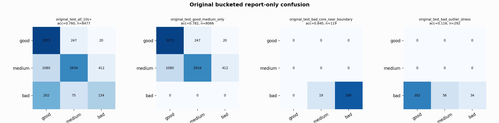

# Original Bucketed Checkpoint Report

Report-only evaluation. It is not used for Clean/SemiClean/node selection.

## Checkpoint

- Variant: `nl_n7184_gm_trim_bad_boundaryblocks_badattackwide_outlier_516d83e0ce44`
- Prediction mode: `simple_pc1_gm_gate_t226`

## Buckets

- `original_all_10s+`: n=32956, acc=0.8323, macro-F1=0.8451, recall good/medium/bad=0.8113/0.8152/0.9343
- `original_test_all_10s+`: n=8477, acc=0.7598, macro-F1=0.6171, recall good/medium/bad=0.9266/0.6629/0.3260
- `original_test_good_medium_only`: n=8066, acc=0.7819, macro-F1=0.5350, recall good/medium/bad=0.9266/0.6629/0.0000
- `original_test_bad_core_near_boundary`: n=119, acc=0.8403, macro-F1=0.3044, recall good/medium/bad=0.0000/0.0000/0.8403
- `original_test_bad_outlier_stress`: n=292, acc=0.1164, macro-F1=0.0695, recall good/medium/bad=0.0000/0.0000/0.1164
- `original_test_drop_bad_outlier_reference`: n=8185, acc=0.7828, macro-F1=0.6368, recall good/medium/bad=0.9266/0.6629/0.8403
- `original_test_good_medium_overlap`: n=7492, acc=0.7652, macro-F1=0.5220, recall good/medium/bad=0.9259/0.6165/0.0000
- `original_all_bad_core_near_boundary`: n=4084, acc=0.9951, macro-F1=0.3325, recall good/medium/bad=0.0000/0.0000/0.9951
- `original_all_bad_outlier_stress`: n=1201, acc=0.7277, macro-F1=0.2808, recall good/medium/bad=0.0000/0.0000/0.7277

## Counts

- Original all 10s+: `32956` windows.
- Original test 10s+: `8477` windows.
- Bad outlier stress is reported separately because dropping it removes most original-test bad windows.

