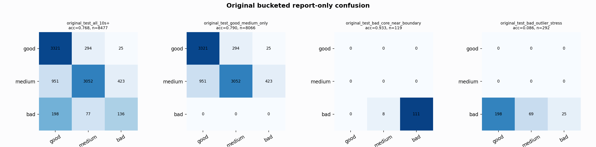

# Original Bucketed Checkpoint Report

Report-only evaluation. It is not used for Clean/SemiClean/node selection.

## Checkpoint

- Variant: `nl_n7185_gm_trim_bad_boundaryblocks_badoutlier_precision__94b8c36292da`
- Prediction mode: `simple_pc1_gm_gate_t254`

## Buckets

- `original_all_10s+`: n=32956, acc=0.8168, macro-F1=0.8330, recall good/medium/bad=0.7702/0.8320/0.9362
- `original_test_all_10s+`: n=8477, acc=0.7678, macro-F1=0.6233, recall good/medium/bad=0.9124/0.6896/0.3309
- `original_test_good_medium_only`: n=8066, acc=0.7901, macro-F1=0.5416, recall good/medium/bad=0.9124/0.6896/0.0000
- `original_test_bad_core_near_boundary`: n=119, acc=0.9328, macro-F1=0.3217, recall good/medium/bad=0.0000/0.0000/0.9328
- `original_test_bad_outlier_stress`: n=292, acc=0.0856, macro-F1=0.0526, recall good/medium/bad=0.0000/0.0000/0.0856
- `original_test_drop_bad_outlier_reference`: n=8185, acc=0.7922, macro-F1=0.6505, recall good/medium/bad=0.9124/0.6896/0.9328
- `original_test_good_medium_overlap`: n=7492, acc=0.7742, macro-F1=0.5297, recall good/medium/bad=0.9114/0.6470/0.0000
- `original_all_bad_core_near_boundary`: n=4084, acc=0.9978, macro-F1=0.3330, recall good/medium/bad=0.0000/0.0000/0.9978
- `original_all_bad_outlier_stress`: n=1201, acc=0.7269, macro-F1=0.2806, recall good/medium/bad=0.0000/0.0000/0.7269

## Counts

- Original all 10s+: `32956` windows.
- Original test 10s+: `8477` windows.
- Bad outlier stress is reported separately because dropping it removes most original-test bad windows.

