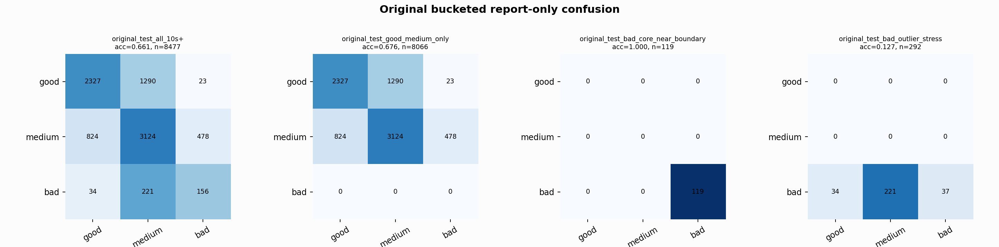

# Original Bucketed Checkpoint Report

Report-only evaluation. It is not used for Clean/SemiClean/node selection.

## Checkpoint

- Variant: `nl_n7186_gm_trim_bad_boundaryblocks_badoutlier_recall_gua_7cd9d3f2aac9`
- Prediction mode: `raw`

## Buckets

- `original_all_10s+`: n=32956, acc=0.7785, macro-F1=0.7967, recall good/medium/bad=0.7782/0.6982/0.9410
- `original_test_all_10s+`: n=8477, acc=0.6614, macro-F1=0.5545, recall good/medium/bad=0.6393/0.7058/0.3796
- `original_test_good_medium_only`: n=8066, acc=0.6758, macro-F1=0.4640, recall good/medium/bad=0.6393/0.7058/0.0000
- `original_test_bad_core_near_boundary`: n=119, acc=1.0000, macro-F1=0.3333, recall good/medium/bad=0.0000/0.0000/1.0000
- `original_test_bad_outlier_stress`: n=292, acc=0.1267, macro-F1=0.0750, recall good/medium/bad=0.0000/0.0000/0.1267
- `original_test_drop_bad_outlier_reference`: n=8185, acc=0.6805, macro-F1=0.5714, recall good/medium/bad=0.6393/0.7058/1.0000
- `original_test_good_medium_overlap`: n=7492, acc=0.6544, macro-F1=0.4517, recall good/medium/bad=0.6355/0.6720/0.0000
- `original_all_bad_core_near_boundary`: n=4084, acc=0.9998, macro-F1=0.3333, recall good/medium/bad=0.0000/0.0000/0.9998
- `original_all_bad_outlier_stress`: n=1201, acc=0.7410, macro-F1=0.2838, recall good/medium/bad=0.0000/0.0000/0.7410

## Counts

- Original all 10s+: `32956` windows.
- Original test 10s+: `8477` windows.
- Bad outlier stress is reported separately because dropping it removes most original-test bad windows.

