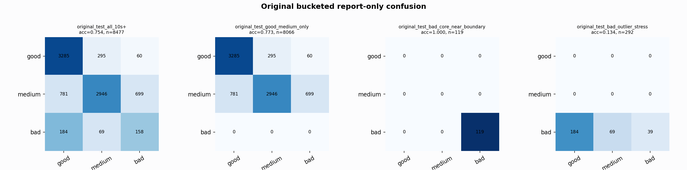

# Original Bucketed Checkpoint Report

Report-only evaluation. It is not used for Clean/SemiClean/node selection.

## Checkpoint

- Variant: `nl_n7187_gm_trim_bad_boundaryblocks_badoutlier_detail_gua_ad4d4fc935ac`
- Prediction mode: `simple_pc1_gm_gate_t254`

## Buckets

- `original_all_10s+`: n=32956, acc=0.8124, macro-F1=0.8235, recall good/medium/bad=0.7668/0.8217/0.9408
- `original_test_all_10s+`: n=8477, acc=0.7537, macro-F1=0.6108, recall good/medium/bad=0.9025/0.6656/0.3844
- `original_test_good_medium_only`: n=8066, acc=0.7725, macro-F1=0.5404, recall good/medium/bad=0.9025/0.6656/0.0000
- `original_test_bad_core_near_boundary`: n=119, acc=1.0000, macro-F1=0.3333, recall good/medium/bad=0.0000/0.0000/1.0000
- `original_test_bad_outlier_stress`: n=292, acc=0.1336, macro-F1=0.0785, recall good/medium/bad=0.0000/0.0000/0.1336
- `original_test_drop_bad_outlier_reference`: n=8185, acc=0.7758, macro-F1=0.6199, recall good/medium/bad=0.9025/0.6656/1.0000
- `original_test_good_medium_overlap`: n=7492, acc=0.7583, macro-F1=0.5289, recall good/medium/bad=0.9014/0.6257/0.0000
- `original_all_bad_core_near_boundary`: n=4084, acc=0.9998, macro-F1=0.3333, recall good/medium/bad=0.0000/0.0000/0.9998
- `original_all_bad_outlier_stress`: n=1201, acc=0.7402, macro-F1=0.2836, recall good/medium/bad=0.0000/0.0000/0.7402

## Counts

- Original all 10s+: `32956` windows.
- Original test 10s+: `8477` windows.
- Bad outlier stress is reported separately because dropping it removes most original-test bad windows.

