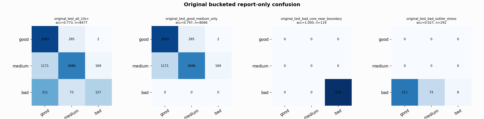

# Original Bucketed Checkpoint Report

Report-only evaluation. It is not used for Clean/SemiClean/node selection.

## Checkpoint

- Variant: `nl_n7187_gm_trim_bad_boundaryblocks_badoutlier_detail_pus_e71b4ab0102f`
- Prediction mode: `simple_pc1_gm_gate_t254`

## Buckets

- `original_all_10s+`: n=32956, acc=0.8213, macro-F1=0.8446, recall good/medium/bad=0.7746/0.8403/0.9340
- `original_test_all_10s+`: n=8477, acc=0.7734, macro-F1=0.6469, recall good/medium/bad=0.9184/0.6972/0.3090
- `original_test_good_medium_only`: n=8066, acc=0.7970, macro-F1=0.5368, recall good/medium/bad=0.9184/0.6972/0.0000
- `original_test_bad_core_near_boundary`: n=119, acc=1.0000, macro-F1=0.3333, recall good/medium/bad=0.0000/0.0000/1.0000
- `original_test_bad_outlier_stress`: n=292, acc=0.0274, macro-F1=0.0178, recall good/medium/bad=0.0000/0.0000/0.0274
- `original_test_drop_bad_outlier_reference`: n=8185, acc=0.8000, macro-F1=0.7308, recall good/medium/bad=0.9184/0.6972/1.0000
- `original_test_good_medium_overlap`: n=7492, acc=0.7822, macro-F1=0.5255, recall good/medium/bad=0.9175/0.6568/0.0000
- `original_all_bad_core_near_boundary`: n=4084, acc=0.9998, macro-F1=0.3333, recall good/medium/bad=0.0000/0.0000/0.9998
- `original_all_bad_outlier_stress`: n=1201, acc=0.7102, macro-F1=0.2769, recall good/medium/bad=0.0000/0.0000/0.7102

## Counts

- Original all 10s+: `32956` windows.
- Original test 10s+: `8477` windows.
- Bad outlier stress is reported separately because dropping it removes most original-test bad windows.

