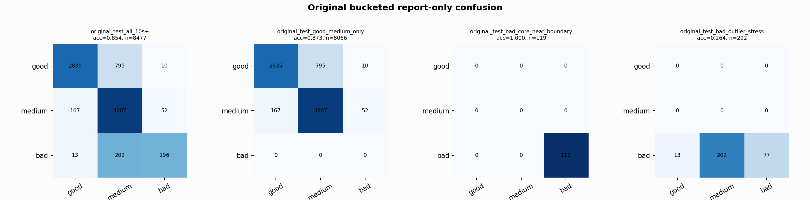

# Original Bucketed Checkpoint Report

Report-only evaluation. It is not used for Clean/SemiClean/node selection.

## Checkpoint

- Variant: `nl_n7188_gm_trim_bad_boundaryblocks_badoutlier_visqrsnarr_a364001dc6cf`
- Prediction mode: `feature_pc1_qrsprom_plus_precision_veto`

## Buckets

- `original_all_10s+`: n=32956, acc=0.8393, macro-F1=0.8640, recall good/medium/bad=0.7344/0.9541/0.9468
- `original_test_all_10s+`: n=8477, acc=0.8538, macro-F1=0.7706, recall good/medium/bad=0.7788/0.9505/0.4769
- `original_test_good_medium_only`: n=8066, acc=0.8730, macro-F1=0.5820, recall good/medium/bad=0.7788/0.9505/0.0000
- `original_test_bad_core_near_boundary`: n=119, acc=1.0000, macro-F1=0.3333, recall good/medium/bad=0.0000/0.0000/1.0000
- `original_test_bad_outlier_stress`: n=292, acc=0.2637, macro-F1=0.1391, recall good/medium/bad=0.0000/0.0000/0.2637
- `original_test_drop_bad_outlier_reference`: n=8185, acc=0.8749, macro-F1=0.8465, recall good/medium/bad=0.7788/0.9505/1.0000
- `original_test_good_medium_overlap`: n=7492, acc=0.8633, macro-F1=0.5769, recall good/medium/bad=0.7765/0.9437/0.0000
- `original_all_bad_core_near_boundary`: n=4084, acc=1.0000, macro-F1=0.3333, recall good/medium/bad=0.0000/0.0000/1.0000
- `original_all_bad_outlier_stress`: n=1201, acc=0.7660, macro-F1=0.2892, recall good/medium/bad=0.0000/0.0000/0.7660

## Counts

- Original all 10s+: `32956` windows.
- Original test 10s+: `8477` windows.
- Bad outlier stress is reported separately because dropping it removes most original-test bad windows.

