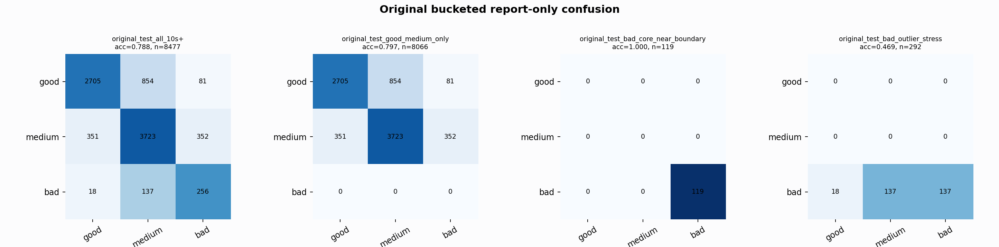

# Original Bucketed Checkpoint Report

Report-only evaluation. It is not used for Clean/SemiClean/node selection.

## Checkpoint

- Variant: `nl_n7188_gm_trim_bad_boundaryblocks_badoutlier_visqrsnarr_a364001dc6cf`
- Prediction mode: `raw_bad_veto_visibleqrs_balanced`

## Buckets

- `original_all_10s+`: n=32956, acc=0.7895, macro-F1=0.8158, recall good/medium/bad=0.6759/0.8876/0.9588
- `original_test_all_10s+`: n=8477, acc=0.7885, macro-F1=0.6953, recall good/medium/bad=0.7431/0.8412/0.6229
- `original_test_good_medium_only`: n=8066, acc=0.7969, macro-F1=0.5450, recall good/medium/bad=0.7431/0.8412/0.0000
- `original_test_bad_core_near_boundary`: n=119, acc=1.0000, macro-F1=0.3333, recall good/medium/bad=0.0000/0.0000/1.0000
- `original_test_bad_outlier_stress`: n=292, acc=0.4692, macro-F1=0.2129, recall good/medium/bad=0.0000/0.0000/0.4692
- `original_test_drop_bad_outlier_reference`: n=8185, acc=0.7999, macro-F1=0.6632, recall good/medium/bad=0.7431/0.8412/1.0000
- `original_test_good_medium_overlap`: n=7492, acc=0.7835, macro-F1=0.5374, recall good/medium/bad=0.7404/0.8234/0.0000
- `original_all_bad_core_near_boundary`: n=4084, acc=0.9998, macro-F1=0.3333, recall good/medium/bad=0.0000/0.0000/0.9998
- `original_all_bad_outlier_stress`: n=1201, acc=0.8193, macro-F1=0.3002, recall good/medium/bad=0.0000/0.0000/0.8193

## Counts

- Original all 10s+: `32956` windows.
- Original test 10s+: `8477` windows.
- Bad outlier stress is reported separately because dropping it removes most original-test bad windows.

