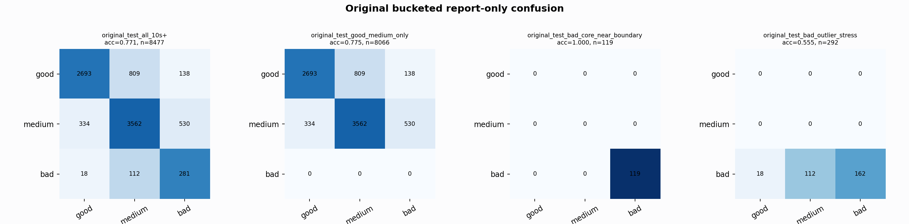

# Original Bucketed Checkpoint Report

Report-only evaluation. It is not used for Clean/SemiClean/node selection.

## Checkpoint

- Variant: `nl_n7188_gm_trim_bad_boundaryblocks_badoutlier_visqrsnarr_a364001dc6cf`
- Prediction mode: `raw_bad_veto_visibleqrs_stress`

## Buckets

- `original_all_10s+`: n=32956, acc=0.7836, macro-F1=0.8050, recall good/medium/bad=0.6749/0.8685/0.9637
- `original_test_all_10s+`: n=8477, acc=0.7710, macro-F1=0.6729, recall good/medium/bad=0.7398/0.8048/0.6837
- `original_test_good_medium_only`: n=8066, acc=0.7755, macro-F1=0.5392, recall good/medium/bad=0.7398/0.8048/0.0000
- `original_test_bad_core_near_boundary`: n=119, acc=1.0000, macro-F1=0.3333, recall good/medium/bad=0.0000/0.0000/1.0000
- `original_test_bad_outlier_stress`: n=292, acc=0.5548, macro-F1=0.2379, recall good/medium/bad=0.0000/0.0000/0.5548
- `original_test_drop_bad_outlier_reference`: n=8185, acc=0.7787, macro-F1=0.6268, recall good/medium/bad=0.7398/0.8048/1.0000
- `original_test_good_medium_overlap`: n=7492, acc=0.7604, macro-F1=0.5306, recall good/medium/bad=0.7371/0.7820/0.0000
- `original_all_bad_core_near_boundary`: n=4084, acc=0.9998, macro-F1=0.3333, recall good/medium/bad=0.0000/0.0000/0.9998
- `original_all_bad_outlier_stress`: n=1201, acc=0.8410, macro-F1=0.3045, recall good/medium/bad=0.0000/0.0000/0.8410

## Counts

- Original all 10s+: `32956` windows.
- Original test 10s+: `8477` windows.
- Bad outlier stress is reported separately because dropping it removes most original-test bad windows.

