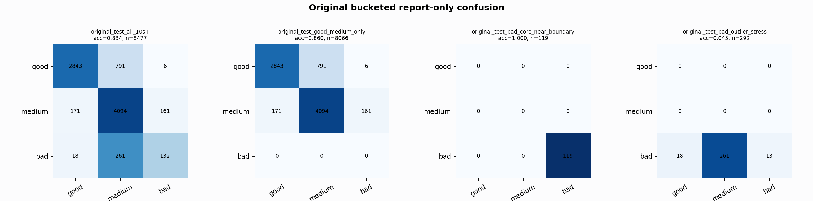

# Original Bucketed Checkpoint Report

Report-only evaluation. It is not used for Clean/SemiClean/node selection.

## Checkpoint

- Variant: `nl_n7188_gm_trim_bad_boundaryblocks_badoutlier_visqrsnarr_a364001dc6cf`
- Prediction mode: `rawbad_feature_pc1_qrsprom_tree`

## Buckets

- `original_all_10s+`: n=32956, acc=0.8334, macro-F1=0.8554, recall good/medium/bad=0.7350/0.9405/0.9357
- `original_test_all_10s+`: n=8477, acc=0.8339, macro-F1=0.6932, recall good/medium/bad=0.7810/0.9250/0.3212
- `original_test_good_medium_only`: n=8066, acc=0.8600, macro-F1=0.5780, recall good/medium/bad=0.7810/0.9250/0.0000
- `original_test_bad_core_near_boundary`: n=119, acc=1.0000, macro-F1=0.3333, recall good/medium/bad=0.0000/0.0000/1.0000
- `original_test_bad_outlier_stress`: n=292, acc=0.0445, macro-F1=0.0284, recall good/medium/bad=0.0000/0.0000/0.0445
- `original_test_drop_bad_outlier_reference`: n=8185, acc=0.8621, macro-F1=0.7739, recall good/medium/bad=0.7810/0.9250/1.0000
- `original_test_good_medium_overlap`: n=7492, acc=0.8512, macro-F1=0.5728, recall good/medium/bad=0.7787/0.9183/0.0000
- `original_all_bad_core_near_boundary`: n=4084, acc=1.0000, macro-F1=0.3333, recall good/medium/bad=0.0000/0.0000/1.0000
- `original_all_bad_outlier_stress`: n=1201, acc=0.7169, macro-F1=0.2784, recall good/medium/bad=0.0000/0.0000/0.7169

## Counts

- Original all 10s+: `32956` windows.
- Original test 10s+: `8477` windows.
- Bad outlier stress is reported separately because dropping it removes most original-test bad windows.

