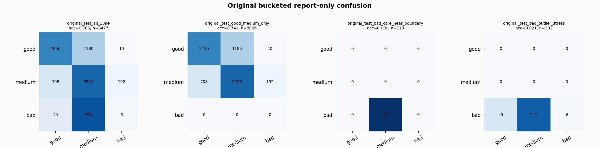

# Original Bucketed Checkpoint Report

Report-only evaluation. It is not used for Clean/SemiClean/node selection.

## Checkpoint

- Variant: `nl_n7200_gm_trim_bad_geom_badstress_controlled_b008_g003__55b8bf9aeb37`
- Prediction mode: `medium_guarded_pmed001`

## Buckets

- `original_all_10s+`: n=32956, acc=0.7967, macro-F1=0.8210, recall good/medium/bad=0.7444/0.8240/0.9101
- `original_test_all_10s+`: n=8477, acc=0.7057, macro-F1=0.4928, recall good/medium/bad=0.6731/0.7967/0.0146
- `original_test_good_medium_only`: n=8066, acc=0.7409, macro-F1=0.4977, recall good/medium/bad=0.6731/0.7967/0.0000
- `original_test_bad_core_near_boundary`: n=119, acc=0.0000, macro-F1=0.0000, recall good/medium/bad=0.0000/0.0000/0.0000
- `original_test_bad_outlier_stress`: n=292, acc=0.0205, macro-F1=0.0134, recall good/medium/bad=0.0000/0.0000/0.0205
- `original_test_drop_bad_outlier_reference`: n=8185, acc=0.7301, macro-F1=0.4944, recall good/medium/bad=0.6731/0.7967/0.0000
- `original_test_good_medium_overlap`: n=7492, acc=0.7242, macro-F1=0.4886, recall good/medium/bad=0.6696/0.7748/0.0000
- `original_all_bad_core_near_boundary`: n=4084, acc=0.9706, macro-F1=0.3284, recall good/medium/bad=0.0000/0.0000/0.9706
- `original_all_bad_outlier_stress`: n=1201, acc=0.7044, macro-F1=0.2755, recall good/medium/bad=0.0000/0.0000/0.7044

## Counts

- Original all 10s+: `32956` windows.
- Original test 10s+: `8477` windows.
- Bad outlier stress is reported separately because dropping it removes most original-test bad windows.

