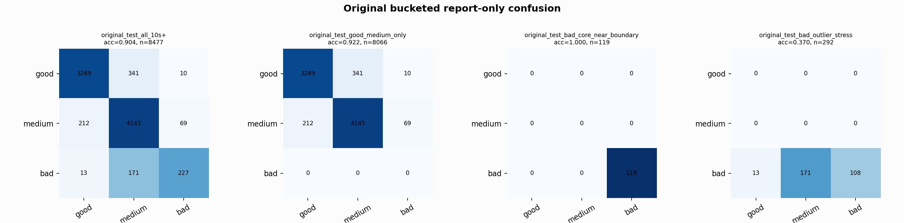

# Original Bucketed Checkpoint Report

Report-only evaluation. It is not used for Clean/SemiClean/node selection.

## Checkpoint

- Variant: `nl_n7200_gm_trim_bad_goodlike_aux_tail_a12_good128_mid168_837d9498a6ae`
- Prediction mode: `feature_pc1_qrsprom_visiblegood_wavegood_largeblock_diagnostic`

## Buckets

- `original_all_10s+`: n=32956, acc=0.8270, macro-F1=0.8543, recall good/medium/bad=0.7246/0.9285/0.9531
- `original_test_all_10s+`: n=8477, acc=0.9037, macro-F1=0.8218, recall good/medium/bad=0.9036/0.9365/0.5523
- `original_test_good_medium_only`: n=8066, acc=0.9216, macro-F1=0.6171, recall good/medium/bad=0.9036/0.9365/0.0000
- `original_test_bad_core_near_boundary`: n=119, acc=1.0000, macro-F1=0.3333, recall good/medium/bad=0.0000/0.0000/1.0000
- `original_test_bad_outlier_stress`: n=292, acc=0.3699, macro-F1=0.1800, recall good/medium/bad=0.0000/0.0000/0.3699
- `original_test_drop_bad_outlier_reference`: n=8185, acc=0.9228, macro-F1=0.8674, recall good/medium/bad=0.9036/0.9365/1.0000
- `original_test_good_medium_overlap`: n=7492, acc=0.9156, macro-F1=0.6137, recall good/medium/bad=0.9026/0.9278/0.0000
- `original_all_bad_core_near_boundary`: n=4084, acc=1.0000, macro-F1=0.3333, recall good/medium/bad=0.0000/0.0000/1.0000
- `original_all_bad_outlier_stress`: n=1201, acc=0.7935, macro-F1=0.2950, recall good/medium/bad=0.0000/0.0000/0.7935

## Counts

- Original all 10s+: `32956` windows.
- Original test 10s+: `8477` windows.
- Bad outlier stress is reported separately because dropping it removes most original-test bad windows.

