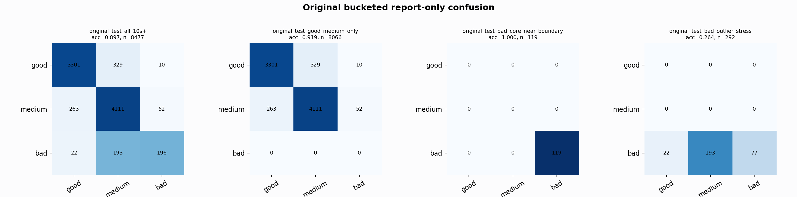

# Original Bucketed Checkpoint Report

Report-only evaluation. It is not used for Clean/SemiClean/node selection.

## Checkpoint

- Variant: `nl_n7200_gm_trim_bad_goodlike_aux_tail_a12_good128_mid168_837d9498a6ae`
- Prediction mode: `feature_pc1_qrsprom_visiblegood_wavegood_plus_precision_veto`

## Buckets

- `original_all_10s+`: n=32956, acc=0.8351, macro-F1=0.8594, recall good/medium/bad=0.7630/0.8949/0.9470
- `original_test_all_10s+`: n=8477, acc=0.8975, macro-F1=0.8024, recall good/medium/bad=0.9069/0.9288/0.4769
- `original_test_good_medium_only`: n=8066, acc=0.9189, macro-F1=0.6146, recall good/medium/bad=0.9069/0.9288/0.0000
- `original_test_bad_core_near_boundary`: n=119, acc=1.0000, macro-F1=0.3333, recall good/medium/bad=0.0000/0.0000/1.0000
- `original_test_bad_outlier_stress`: n=292, acc=0.2637, macro-F1=0.1391, recall good/medium/bad=0.0000/0.0000/0.2637
- `original_test_drop_bad_outlier_reference`: n=8185, acc=0.9201, macro-F1=0.8790, recall good/medium/bad=0.9069/0.9288/1.0000
- `original_test_good_medium_overlap`: n=7492, acc=0.9128, macro-F1=0.6111, recall good/medium/bad=0.9059/0.9193/0.0000
- `original_all_bad_core_near_boundary`: n=4084, acc=1.0000, macro-F1=0.3333, recall good/medium/bad=0.0000/0.0000/1.0000
- `original_all_bad_outlier_stress`: n=1201, acc=0.7669, macro-F1=0.2893, recall good/medium/bad=0.0000/0.0000/0.7669

## Counts

- Original all 10s+: `32956` windows.
- Original test 10s+: `8477` windows.
- Bad outlier stress is reported separately because dropping it removes most original-test bad windows.

