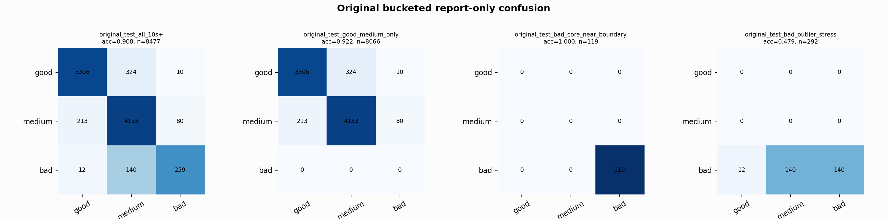

# Original Bucketed Checkpoint Report

Report-only evaluation. It is not used for Clean/SemiClean/node selection.

## Checkpoint

- Variant: `nl_n7200_gm_trim_bad_goodlike_aux_tail_a12_good128_mid168_837d9498a6ae`
- Prediction mode: `feature_pc1_qrsprom_visiblegood_wavegood_axis_diagnostic`

## Buckets

- `original_all_10s+`: n=32956, acc=0.8280, macro-F1=0.8554, recall good/medium/bad=0.7256/0.9261/0.9612
- `original_test_all_10s+`: n=8477, acc=0.9081, macro-F1=0.8399, recall good/medium/bad=0.9082/0.9338/0.6302
- `original_test_good_medium_only`: n=8066, acc=0.9223, macro-F1=0.6180, recall good/medium/bad=0.9082/0.9338/0.0000
- `original_test_bad_core_near_boundary`: n=119, acc=1.0000, macro-F1=0.3333, recall good/medium/bad=0.0000/0.0000/1.0000
- `original_test_bad_outlier_stress`: n=292, acc=0.4795, macro-F1=0.2160, recall good/medium/bad=0.0000/0.0000/0.4795
- `original_test_drop_bad_outlier_reference`: n=8185, acc=0.9234, macro-F1=0.8599, recall good/medium/bad=0.9082/0.9338/1.0000
- `original_test_good_medium_overlap`: n=7492, acc=0.9163, macro-F1=0.6146, recall good/medium/bad=0.9073/0.9247/0.0000
- `original_all_bad_core_near_boundary`: n=4084, acc=1.0000, macro-F1=0.3333, recall good/medium/bad=0.0000/0.0000/1.0000
- `original_all_bad_outlier_stress`: n=1201, acc=0.8293, macro-F1=0.3022, recall good/medium/bad=0.0000/0.0000/0.8293

## Counts

- Original all 10s+: `32956` windows.
- Original test 10s+: `8477` windows.
- Bad outlier stress is reported separately because dropping it removes most original-test bad windows.

