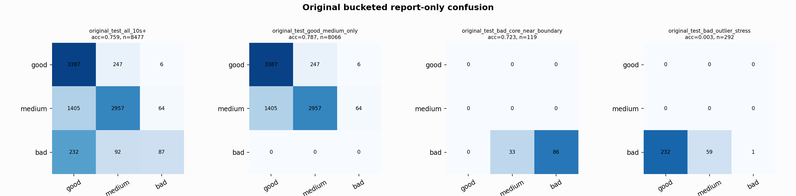

# Original Bucketed Checkpoint Report

Report-only evaluation. It is not used for Clean/SemiClean/node selection.

## Checkpoint

- Variant: `nl_n7600_gm_trim_bad_boundaryblocks_bigjump_origdomain_n7_683525503520`
- Prediction mode: `simple_pc1_gm_gate_t226`

## Buckets

- `original_all_10s+`: n=32956, acc=0.8322, macro-F1=0.8518, recall good/medium/bad=0.8117/0.8186/0.9256
- `original_test_all_10s+`: n=8477, acc=0.7586, macro-F1=0.6180, recall good/medium/bad=0.9305/0.6681/0.2117
- `original_test_good_medium_only`: n=8066, acc=0.7865, macro-F1=0.5262, recall good/medium/bad=0.9305/0.6681/0.0000
- `original_test_bad_core_near_boundary`: n=119, acc=0.7227, macro-F1=0.2797, recall good/medium/bad=0.0000/0.0000/0.7227
- `original_test_bad_outlier_stress`: n=292, acc=0.0034, macro-F1=0.0023, recall good/medium/bad=0.0000/0.0000/0.0034
- `original_test_drop_bad_outlier_reference`: n=8185, acc=0.7856, macro-F1=0.7335, recall good/medium/bad=0.9305/0.6681/0.7227
- `original_test_good_medium_overlap`: n=7492, acc=0.7702, macro-F1=0.5133, recall good/medium/bad=0.9298/0.6224/0.0000
- `original_all_bad_core_near_boundary`: n=4084, acc=0.9917, macro-F1=0.3319, recall good/medium/bad=0.0000/0.0000/0.9917
- `original_all_bad_outlier_stress`: n=1201, acc=0.7011, macro-F1=0.2748, recall good/medium/bad=0.0000/0.0000/0.7011

## Counts

- Original all 10s+: `32956` windows.
- Original test 10s+: `8477` windows.
- Bad outlier stress is reported separately because dropping it removes most original-test bad windows.

