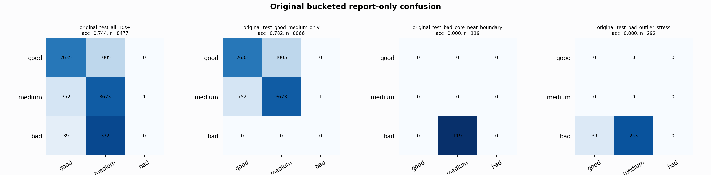

# Original Bucketed Checkpoint Report

Report-only evaluation. It is not used for Clean/SemiClean/node selection.

## Checkpoint

- Variant: `nl_n7600_gm_trim_bad_boundaryblocks_bigjump_balanced_n720_0e77277acfdc`
- Prediction mode: `raw`

## Buckets

- `original_all_10s+`: n=32956, acc=0.8242, macro-F1=0.8448, recall good/medium/bad=0.8176/0.7963/0.9018
- `original_test_all_10s+`: n=8477, acc=0.7441, macro-F1=0.5070, recall good/medium/bad=0.7239/0.8299/0.0000
- `original_test_good_medium_only`: n=8066, acc=0.7820, macro-F1=0.5190, recall good/medium/bad=0.7239/0.8299/0.0000
- `original_test_bad_core_near_boundary`: n=119, acc=0.0000, macro-F1=0.0000, recall good/medium/bad=0.0000/0.0000/0.0000
- `original_test_bad_outlier_stress`: n=292, acc=0.0000, macro-F1=0.0000, recall good/medium/bad=0.0000/0.0000/0.0000
- `original_test_drop_bad_outlier_reference`: n=8185, acc=0.7707, macro-F1=0.5155, recall good/medium/bad=0.7239/0.8299/0.0000
- `original_test_good_medium_overlap`: n=7492, acc=0.7678, macro-F1=0.5110, recall good/medium/bad=0.7210/0.8111/0.0000
- `original_all_bad_core_near_boundary`: n=4084, acc=0.9706, macro-F1=0.3284, recall good/medium/bad=0.0000/0.0000/0.9706
- `original_all_bad_outlier_stress`: n=1201, acc=0.6678, macro-F1=0.2669, recall good/medium/bad=0.0000/0.0000/0.6678

## Counts

- Original all 10s+: `32956` windows.
- Original test 10s+: `8477` windows.
- Bad outlier stress is reported separately because dropping it removes most original-test bad windows.

