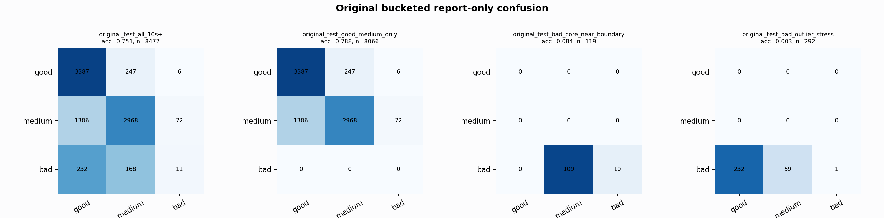

# Original Bucketed Checkpoint Report

Report-only evaluation. It is not used for Clean/SemiClean/node selection.

## Checkpoint

- Variant: `nl_n8000_gm_trim_bad_boundaryblocks_bigjump_origdomain_n7_da326c95bd21`
- Prediction mode: `simple_pc1_gm_gate_t226`

## Buckets

- `original_all_10s+`: n=32956, acc=0.8312, macro-F1=0.8503, recall good/medium/bad=0.8136/0.8199/0.9107
- `original_test_all_10s+`: n=8477, acc=0.7510, macro-F1=0.5292, recall good/medium/bad=0.9305/0.6706/0.0268
- `original_test_good_medium_only`: n=8066, acc=0.7879, macro-F1=0.5273, recall good/medium/bad=0.9305/0.6706/0.0000
- `original_test_bad_core_near_boundary`: n=119, acc=0.0840, macro-F1=0.0517, recall good/medium/bad=0.0000/0.0000/0.0840
- `original_test_bad_outlier_stress`: n=292, acc=0.0034, macro-F1=0.0023, recall good/medium/bad=0.0000/0.0000/0.0034
- `original_test_drop_bad_outlier_reference`: n=8185, acc=0.7776, macro-F1=0.5559, recall good/medium/bad=0.9305/0.6706/0.0840
- `original_test_good_medium_overlap`: n=7492, acc=0.7716, macro-F1=0.5146, recall good/medium/bad=0.9298/0.6252/0.0000
- `original_all_bad_core_near_boundary`: n=4084, acc=0.9731, macro-F1=0.3288, recall good/medium/bad=0.0000/0.0000/0.9731
- `original_all_bad_outlier_stress`: n=1201, acc=0.6986, macro-F1=0.2742, recall good/medium/bad=0.0000/0.0000/0.6986

## Counts

- Original all 10s+: `32956` windows.
- Original test 10s+: `8477` windows.
- Bad outlier stress is reported separately because dropping it removes most original-test bad windows.

