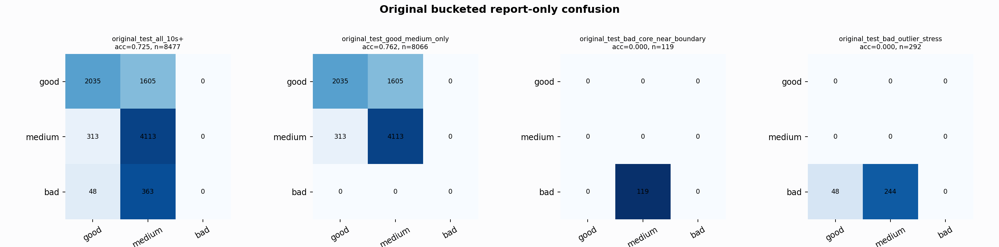

# Original Bucketed Checkpoint Report

Report-only evaluation. It is not used for Clean/SemiClean/node selection.

## Checkpoint

- Variant: `nl_n8400_gm_trim_bad_boundaryblocks_bigjump_origdomain_n7_5db65e4c5efd`
- Prediction mode: `raw`

## Buckets

- `original_all_10s+`: n=32956, acc=0.6984, macro-F1=0.7511, recall good/medium/bad=0.4759/0.9516/0.9063
- `original_test_all_10s+`: n=8477, acc=0.7253, macro-F1=0.4857, recall good/medium/bad=0.5591/0.9293/0.0000
- `original_test_good_medium_only`: n=8066, acc=0.7622, macro-F1=0.4969, recall good/medium/bad=0.5591/0.9293/0.0000
- `original_test_bad_core_near_boundary`: n=119, acc=0.0000, macro-F1=0.0000, recall good/medium/bad=0.0000/0.0000/0.0000
- `original_test_bad_outlier_stress`: n=292, acc=0.0000, macro-F1=0.0000, recall good/medium/bad=0.0000/0.0000/0.0000
- `original_test_drop_bad_outlier_reference`: n=8185, acc=0.7511, macro-F1=0.4937, recall good/medium/bad=0.5591/0.9293/0.0000
- `original_test_good_medium_overlap`: n=7492, acc=0.7460, macro-F1=0.4896, recall good/medium/bad=0.5580/0.9201/0.0000
- `original_all_bad_core_near_boundary`: n=4084, acc=0.9706, macro-F1=0.3284, recall good/medium/bad=0.0000/0.0000/0.9706
- `original_all_bad_outlier_stress`: n=1201, acc=0.6878, macro-F1=0.2717, recall good/medium/bad=0.0000/0.0000/0.6878

## Counts

- Original all 10s+: `32956` windows.
- Original test 10s+: `8477` windows.
- Bad outlier stress is reported separately because dropping it removes most original-test bad windows.

