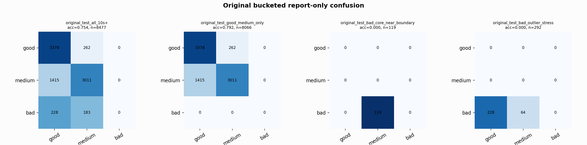

# Original Bucketed Checkpoint Report

Report-only evaluation. It is not used for Clean/SemiClean/node selection.

## Checkpoint

- Variant: `nl_n8400_gm_trim_bad_boundaryblocks_bigjump_mediumwall_n7_1cc9f65727d1`
- Prediction mode: `simple_pc1_gm_gate_trainfit`

## Buckets

- `original_all_10s+`: n=32956, acc=0.8279, macro-F1=0.8502, recall good/medium/bad=0.8028/0.8280/0.9086
- `original_test_all_10s+`: n=8477, acc=0.7537, macro-F1=0.5147, recall good/medium/bad=0.9280/0.6803/0.0000
- `original_test_good_medium_only`: n=8066, acc=0.7921, macro-F1=0.5278, recall good/medium/bad=0.9280/0.6803/0.0000
- `original_test_bad_core_near_boundary`: n=119, acc=0.0000, macro-F1=0.0000, recall good/medium/bad=0.0000/0.0000/0.0000
- `original_test_bad_outlier_stress`: n=292, acc=0.0000, macro-F1=0.0000, recall good/medium/bad=0.0000/0.0000/0.0000
- `original_test_drop_bad_outlier_reference`: n=8185, acc=0.7806, macro-F1=0.5238, recall good/medium/bad=0.9280/0.6803/0.0000
- `original_test_good_medium_overlap`: n=7492, acc=0.7762, macro-F1=0.5154, recall good/medium/bad=0.9273/0.6362/0.0000
- `original_all_bad_core_near_boundary`: n=4084, acc=0.9706, macro-F1=0.3284, recall good/medium/bad=0.0000/0.0000/0.9706
- `original_all_bad_outlier_stress`: n=1201, acc=0.6978, macro-F1=0.2740, recall good/medium/bad=0.0000/0.0000/0.6978

## Counts

- Original all 10s+: `32956` windows.
- Original test 10s+: `8477` windows.
- Bad outlier stress is reported separately because dropping it removes most original-test bad windows.

