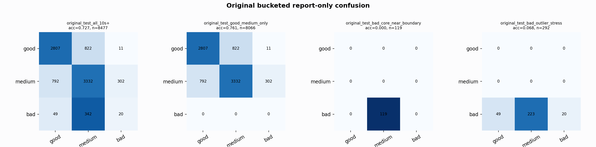

# Original Bucketed Checkpoint Report

Report-only evaluation. It is not used for Clean/SemiClean/node selection.

## Checkpoint

- Variant: `nl_n9000_gm_trim_bad_boundaryblocks_bigjump_badprobe_n840_b9b9c625fde1`
- Prediction mode: `raw`

## Buckets

- `original_all_10s+`: n=32956, acc=0.8113, macro-F1=0.8296, recall good/medium/bad=0.7743/0.8205/0.9118
- `original_test_all_10s+`: n=8477, acc=0.7266, macro-F1=0.5237, recall good/medium/bad=0.7712/0.7528/0.0487
- `original_test_good_medium_only`: n=8066, acc=0.7611, macro-F1=0.5174, recall good/medium/bad=0.7712/0.7528/0.0000
- `original_test_bad_core_near_boundary`: n=119, acc=0.0000, macro-F1=0.0000, recall good/medium/bad=0.0000/0.0000/0.0000
- `original_test_bad_outlier_stress`: n=292, acc=0.0685, macro-F1=0.0427, recall good/medium/bad=0.0000/0.0000/0.0685
- `original_test_drop_bad_outlier_reference`: n=8185, acc=0.7500, macro-F1=0.5139, recall good/medium/bad=0.7712/0.7528/0.0000
- `original_test_good_medium_overlap`: n=7492, acc=0.7476, macro-F1=0.5093, recall good/medium/bad=0.7687/0.7280/0.0000
- `original_all_bad_core_near_boundary`: n=4084, acc=0.9706, macro-F1=0.3284, recall good/medium/bad=0.0000/0.0000/0.9706
- `original_all_bad_outlier_stress`: n=1201, acc=0.7119, macro-F1=0.2772, recall good/medium/bad=0.0000/0.0000/0.7119

## Counts

- Original all 10s+: `32956` windows.
- Original test 10s+: `8477` windows.
- Bad outlier stress is reported separately because dropping it removes most original-test bad windows.

