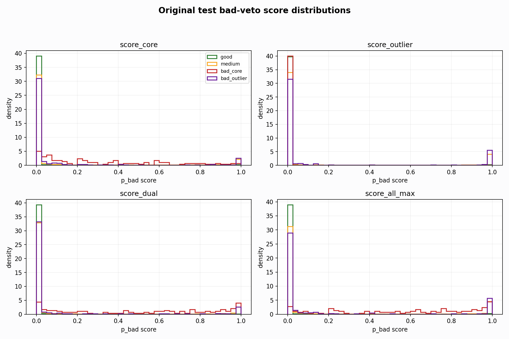
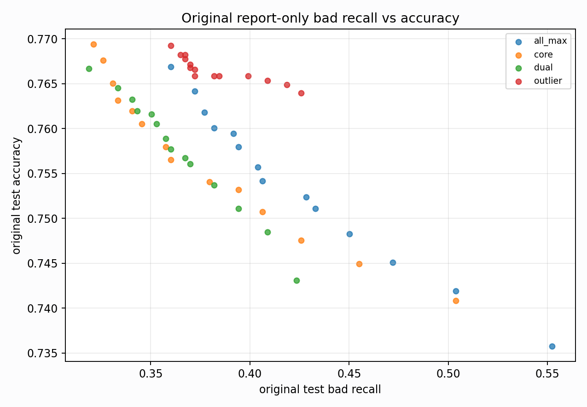

# Original Bad-Veto Tradeoff Analysis

Report-only. Original BUT is used here only to explain domain gaps, not for model selection.

## What This Tests

- Base prediction: `nl_n7183_gm_trim_bad_boundaryblocks_badattackwide_dual_n7_4868958ba680` / `simple_pc1_gm_gate_t254`.
- Bad evidence: raw bad probabilities from `nl_n7182_gm_trim_bad_boundaryblocks_badattackwide_core122_9c92624a97fe`, `nl_n7182_gm_trim_bad_boundaryblocks_badattackwide_outlier_b9dea2cfac81`, `nl_n7182_gm_trim_bad_boundaryblocks_badattackwide_dual_n7_5b567b543eaf`.
- Search space: a bad-score threshold plus optional one-feature gate (`pc1`, `pc2`, `pc3`, `qrs_visibility`).

## Top Balanced Report-Only Rules

| score_col | score_threshold | gate | gate_threshold | test_all_acc | test_all_good_recall | test_all_medium_recall | test_all_bad_recall | bad_core_bad_recall | bad_outlier_bad_recall | gm_false_bad_rate |
| --- | --- | --- | --- | --- | --- | --- | --- | --- | --- | --- |
| score_all_max | 0.0100 | pc3__le | 2.1507 | 0.7518 | 0.8854 | 0.6606 | 0.5499 | 0.9916 | 0.3699 | 0.1353 |
| score_all_max | 0.0100 | pc3__le | 3.2812 | 0.7374 | 0.8854 | 0.6329 | 0.5523 | 0.9916 | 0.3733 | 0.1511 |
| score_all_max | 0.0100 | qrs_visibility__le | 0.2801 | 0.7361 | 0.8860 | 0.6299 | 0.5523 | 0.9916 | 0.3733 | 0.1525 |
| score_all_max | 0.0100 | qrs_visibility__le | 0.3732 | 0.7361 | 0.8860 | 0.6299 | 0.5523 | 0.9916 | 0.3733 | 0.1525 |
| score_all_max | 0.0100 | none |  | 0.7358 | 0.8854 | 0.6297 | 0.5523 | 0.9916 | 0.3733 | 0.1529 |
| score_all_max | 0.0100 | pc2__ge | -1.0634 | 0.7356 | 0.8854 | 0.6304 | 0.5426 | 0.9580 | 0.3733 | 0.1525 |
| score_all_max | 0.0200 | pc3__le | 2.1507 | 0.7544 | 0.8904 | 0.6661 | 0.5012 | 0.9748 | 0.3082 | 0.1241 |
| score_core | 0.0100 | pc3__le | 2.1507 | 0.7531 | 0.8896 | 0.6643 | 0.5012 | 0.9832 | 0.3048 | 0.1208 |
| score_all_max | 0.0100 | qrs_visibility__le | 0.1066 | 0.7391 | 0.8896 | 0.6353 | 0.5231 | 0.9580 | 0.3459 | 0.1465 |
| score_all_max | 0.0100 | pc1__ge | -6.0990 | 0.7345 | 0.8857 | 0.6297 | 0.5231 | 0.9916 | 0.3322 | 0.1494 |
| score_all_max | 0.0200 | pc3__le | 3.2812 | 0.7431 | 0.8904 | 0.6441 | 0.5036 | 0.9748 | 0.3116 | 0.1367 |
| score_core | 0.0100 | pc3__le | 3.2812 | 0.7420 | 0.8896 | 0.6428 | 0.5036 | 0.9832 | 0.3082 | 0.1330 |
| score_all_max | 0.0200 | qrs_visibility__le | 0.2801 | 0.7420 | 0.8907 | 0.6419 | 0.5036 | 0.9748 | 0.3116 | 0.1379 |
| score_all_max | 0.0200 | qrs_visibility__le | 0.3732 | 0.7420 | 0.8907 | 0.6419 | 0.5036 | 0.9748 | 0.3116 | 0.1379 |
| score_all_max | 0.0200 | none |  | 0.7419 | 0.8904 | 0.6419 | 0.5036 | 0.9748 | 0.3116 | 0.1380 |

## Highest Bad Recall Rules

| score_col | score_threshold | gate | gate_threshold | test_all_acc | test_all_good_recall | test_all_medium_recall | test_all_bad_recall | bad_core_bad_recall | bad_outlier_bad_recall | gm_false_bad_rate |
| --- | --- | --- | --- | --- | --- | --- | --- | --- | --- | --- |
| score_all_max | 0.0100 | pc3__le | 3.2812 | 0.7374 | 0.8854 | 0.6329 | 0.5523 | 0.9916 | 0.3733 | 0.1511 |
| score_all_max | 0.0100 | qrs_visibility__le | 0.2801 | 0.7361 | 0.8860 | 0.6299 | 0.5523 | 0.9916 | 0.3733 | 0.1525 |
| score_all_max | 0.0100 | qrs_visibility__le | 0.3732 | 0.7361 | 0.8860 | 0.6299 | 0.5523 | 0.9916 | 0.3733 | 0.1525 |
| score_all_max | 0.0100 | none |  | 0.7358 | 0.8854 | 0.6297 | 0.5523 | 0.9916 | 0.3733 | 0.1529 |
| score_all_max | 0.0100 | pc3__le | 2.1507 | 0.7518 | 0.8854 | 0.6606 | 0.5499 | 0.9916 | 0.3699 | 0.1353 |
| score_all_max | 0.0100 | pc2__ge | -1.0634 | 0.7356 | 0.8854 | 0.6304 | 0.5426 | 0.9580 | 0.3733 | 0.1525 |
| score_all_max | 0.0100 | qrs_visibility__le | 0.1066 | 0.7391 | 0.8896 | 0.6353 | 0.5231 | 0.9580 | 0.3459 | 0.1465 |
| score_all_max | 0.0100 | pc2__ge | 1.9185 | 0.7347 | 0.8854 | 0.6304 | 0.5231 | 0.8908 | 0.3733 | 0.1525 |
| score_all_max | 0.0100 | pc1__ge | -6.0990 | 0.7345 | 0.8857 | 0.6297 | 0.5231 | 0.9916 | 0.3322 | 0.1494 |
| score_all_max | 0.0100 | pc1__le | 0.1571 | 0.7381 | 0.8854 | 0.6371 | 0.5207 | 0.8908 | 0.3699 | 0.1488 |
| score_all_max | 0.0100 | pc2__ge | 5.3700 | 0.7369 | 0.8854 | 0.6353 | 0.5158 | 0.8908 | 0.3630 | 0.1498 |
| score_all_max | 0.0100 | pc1__le | -0.7734 | 0.7439 | 0.8854 | 0.6489 | 0.5134 | 0.8908 | 0.3596 | 0.1423 |
| score_all_max | 0.0100 | pc3__ge | -2.4479 | 0.7365 | 0.8920 | 0.6297 | 0.5085 | 0.9916 | 0.3116 | 0.1422 |
| score_all_max | 0.0100 | pc1__ge | -5.3592 | 0.7353 | 0.8893 | 0.6297 | 0.5085 | 0.9916 | 0.3116 | 0.1420 |
| score_all_max | 0.0200 | pc3__le | 3.2812 | 0.7431 | 0.8904 | 0.6441 | 0.5036 | 0.9748 | 0.3116 | 0.1367 |

## Accuracy-Preserving Rules With Bad Recall >= 0.30

| score_col | score_threshold | gate | gate_threshold | test_all_acc | test_all_good_recall | test_all_medium_recall | test_all_bad_recall | bad_core_bad_recall | bad_outlier_bad_recall | gm_false_bad_rate |
| --- | --- | --- | --- | --- | --- | --- | --- | --- | --- | --- |
| score_outlier | 0.0200 | pc1__le | -3.4616 | 0.7734 | 0.9121 | 0.6948 | 0.3917 | 0.8908 | 0.1884 | 0.0727 |
| score_outlier | 0.0200 | pc3__le | 0.0403 | 0.7732 | 0.9121 | 0.6936 | 0.3990 | 0.8908 | 0.1986 | 0.0739 |
| score_outlier | 0.0100 | pc1__le | -3.4616 | 0.7730 | 0.9107 | 0.6948 | 0.3966 | 0.8908 | 0.1952 | 0.0751 |
| score_outlier | 0.0300 | pc1__le | -3.4616 | 0.7729 | 0.9121 | 0.6948 | 0.3820 | 0.8908 | 0.1747 | 0.0719 |
| score_outlier | 0.0100 | pc3__le | 0.0403 | 0.7729 | 0.9107 | 0.6936 | 0.4063 | 0.8908 | 0.2089 | 0.0767 |
| score_outlier | 0.1000 | pc1__le | -3.4616 | 0.7728 | 0.9129 | 0.6948 | 0.3723 | 0.8908 | 0.1610 | 0.0682 |
| score_outlier | 0.0800 | pc1__le | -3.4616 | 0.7727 | 0.9126 | 0.6948 | 0.3723 | 0.8908 | 0.1610 | 0.0692 |
| score_outlier | 0.0500 | pc1__le | -3.4616 | 0.7727 | 0.9121 | 0.6948 | 0.3771 | 0.8908 | 0.1678 | 0.0703 |
| score_outlier | 0.0300 | pc3__le | 0.0403 | 0.7727 | 0.9121 | 0.6936 | 0.3893 | 0.8908 | 0.1849 | 0.0728 |
| score_outlier | 0.1000 | pc3__le | 0.0403 | 0.7724 | 0.9129 | 0.6939 | 0.3747 | 0.8908 | 0.1644 | 0.0688 |

## Score Distribution Summary

| score_col | bucket | n | mean | p50 | p75 | p90 | p95 | p99 |
| --- | --- | --- | --- | --- | --- | --- | --- | --- |
| score_core | bad_core | 119 | 0.3278 | 0.2421 | 0.5615 | 0.7874 | 0.8945 | 0.9919 |
| score_core | bad_outlier | 292 | 0.1082 | 0.0015 | 0.0195 | 0.4012 | 0.9897 | 0.9995 |
| score_core | good | 3640 | 0.0097 | 0.0000 | 0.0000 | 0.0003 | 0.0023 | 0.3196 |
| score_core | medium | 4426 | 0.1172 | 0.0000 | 0.0036 | 0.6904 | 0.9833 | 0.9999 |
| score_outlier | bad_core | 119 | 0.0001 | 0.0000 | 0.0000 | 0.0000 | 0.0001 | 0.0007 |
| score_outlier | bad_outlier | 292 | 0.1589 | 0.0001 | 0.0064 | 0.9992 | 1.0000 | 1.0000 |
| score_outlier | good | 3640 | 0.0052 | 0.0000 | 0.0000 | 0.0000 | 0.0002 | 0.0044 |
| score_outlier | medium | 4426 | 0.1251 | 0.0000 | 0.0002 | 0.9789 | 0.9999 | 1.0000 |
| score_dual | bad_core | 119 | 0.5168 | 0.5910 | 0.8644 | 0.9718 | 0.9872 | 0.9929 |
| score_dual | bad_outlier | 292 | 0.1011 | 0.0004 | 0.0032 | 0.3978 | 0.9921 | 0.9993 |
| score_dual | good | 3640 | 0.0067 | 0.0000 | 0.0001 | 0.0004 | 0.0020 | 0.1186 |
| score_dual | medium | 4426 | 0.1178 | 0.0000 | 0.0024 | 0.7716 | 0.9911 | 0.9995 |
| score_all_max | bad_core | 119 | 0.5784 | 0.6390 | 0.8814 | 0.9783 | 0.9879 | 0.9976 |
| score_all_max | bad_outlier | 292 | 0.1742 | 0.0028 | 0.0438 | 0.9995 | 1.0000 | 1.0000 |
| score_all_max | good | 3640 | 0.0127 | 0.0000 | 0.0001 | 0.0010 | 0.0042 | 0.5770 |
| score_all_max | medium | 4426 | 0.1565 | 0.0001 | 0.0097 | 0.9921 | 1.0000 | 1.0000 |

## Interpretation

- Clean/node split says the bad specialist is useful; original says the same score is miscalibrated and sweeps many good/medium rows into bad.
- A simple bad-veto branch is promising, but the original threshold needs either domain calibration or a second simple geometry gate.
- The next training-side experiment should therefore be a decoupled bad-veto/head-style objective, not another broad class-weight sweep.

