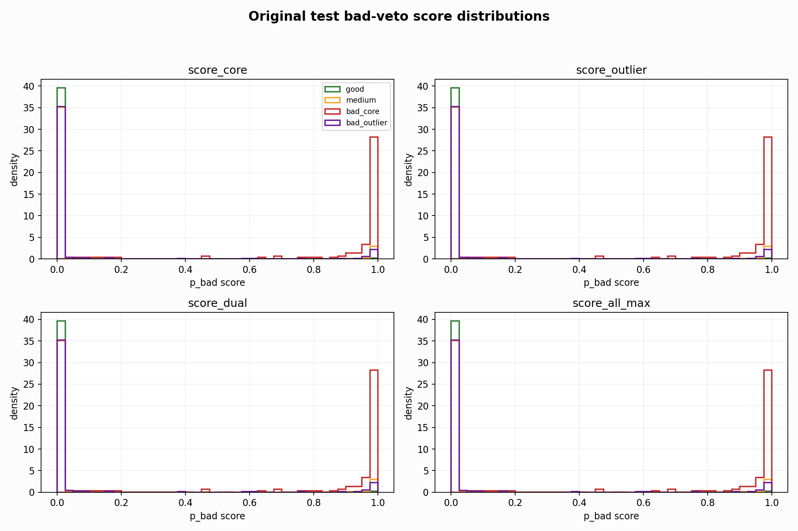
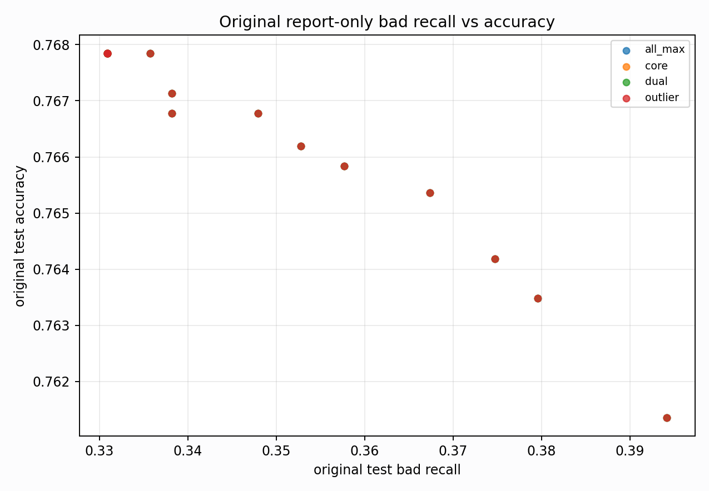

# Original Bad-Veto Tradeoff Analysis

Report-only. Original BUT is used here only to explain domain gaps, not for model selection.

## What This Tests

- Base prediction: `nl_n7185_gm_trim_bad_boundaryblocks_badoutlier_precision__94b8c36292da` / `simple_pc1_gm_gate_t254`.
- Bad evidence: raw bad probabilities from `nl_n7185_gm_trim_bad_boundaryblocks_badoutlier_precision__94b8c36292da`, `nl_n7185_gm_trim_bad_boundaryblocks_badoutlier_precision__94b8c36292da`, `nl_n7185_gm_trim_bad_boundaryblocks_badoutlier_precision__94b8c36292da`.
- Search space: a bad-score threshold plus optional one-feature gate (`pc1`, `pc2`, `pc3`, `qrs_visibility`).

## Top Balanced Report-Only Rules

| score_col | score_threshold | gate | gate_threshold | test_all_acc | test_all_good_recall | test_all_medium_recall | test_all_bad_recall | bad_core_bad_recall | bad_outlier_bad_recall | gm_false_bad_rate |
| --- | --- | --- | --- | --- | --- | --- | --- | --- | --- | --- |
| score_dual | 0.0100 | pc3__le | 2.1507 | 0.7654 | 0.9088 | 0.6821 | 0.3917 | 1.0000 | 0.1438 | 0.0770 |
| score_all_max | 0.0100 | pc3__le | 2.1507 | 0.7654 | 0.9088 | 0.6821 | 0.3917 | 1.0000 | 0.1438 | 0.0770 |
| score_core | 0.0100 | pc3__le | 2.1507 | 0.7654 | 0.9088 | 0.6821 | 0.3917 | 1.0000 | 0.1438 | 0.0770 |
| score_outlier | 0.0100 | pc3__le | 2.1507 | 0.7654 | 0.9088 | 0.6821 | 0.3917 | 1.0000 | 0.1438 | 0.0770 |
| score_dual | 0.0100 | pc3__le | 3.2812 | 0.7616 | 0.9088 | 0.6746 | 0.3942 | 1.0000 | 0.1473 | 0.0812 |
| score_all_max | 0.0100 | pc3__le | 3.2812 | 0.7616 | 0.9088 | 0.6746 | 0.3942 | 1.0000 | 0.1473 | 0.0812 |
| score_core | 0.0100 | pc3__le | 3.2812 | 0.7616 | 0.9088 | 0.6746 | 0.3942 | 1.0000 | 0.1473 | 0.0812 |
| score_outlier | 0.0100 | pc3__le | 3.2812 | 0.7616 | 0.9088 | 0.6746 | 0.3942 | 1.0000 | 0.1473 | 0.0812 |
| score_dual | 0.0100 | none |  | 0.7614 | 0.9088 | 0.6742 | 0.3942 | 1.0000 | 0.1473 | 0.0815 |
| score_dual | 0.0100 | qrs_visibility__le | 0.2801 | 0.7614 | 0.9088 | 0.6742 | 0.3942 | 1.0000 | 0.1473 | 0.0815 |
| score_dual | 0.0100 | qrs_visibility__le | 0.3732 | 0.7614 | 0.9088 | 0.6742 | 0.3942 | 1.0000 | 0.1473 | 0.0815 |
| score_all_max | 0.0100 | none |  | 0.7614 | 0.9088 | 0.6742 | 0.3942 | 1.0000 | 0.1473 | 0.0815 |
| score_all_max | 0.0100 | qrs_visibility__le | 0.2801 | 0.7614 | 0.9088 | 0.6742 | 0.3942 | 1.0000 | 0.1473 | 0.0815 |
| score_all_max | 0.0100 | qrs_visibility__le | 0.3732 | 0.7614 | 0.9088 | 0.6742 | 0.3942 | 1.0000 | 0.1473 | 0.0815 |
| score_core | 0.0100 | none |  | 0.7614 | 0.9088 | 0.6742 | 0.3942 | 1.0000 | 0.1473 | 0.0815 |

## Highest Bad Recall Rules

| score_col | score_threshold | gate | gate_threshold | test_all_acc | test_all_good_recall | test_all_medium_recall | test_all_bad_recall | bad_core_bad_recall | bad_outlier_bad_recall | gm_false_bad_rate |
| --- | --- | --- | --- | --- | --- | --- | --- | --- | --- | --- |
| score_dual | 0.0100 | pc3__le | 3.2812 | 0.7616 | 0.9088 | 0.6746 | 0.3942 | 1.0000 | 0.1473 | 0.0812 |
| score_all_max | 0.0100 | pc3__le | 3.2812 | 0.7616 | 0.9088 | 0.6746 | 0.3942 | 1.0000 | 0.1473 | 0.0812 |
| score_core | 0.0100 | pc3__le | 3.2812 | 0.7616 | 0.9088 | 0.6746 | 0.3942 | 1.0000 | 0.1473 | 0.0812 |
| score_outlier | 0.0100 | pc3__le | 3.2812 | 0.7616 | 0.9088 | 0.6746 | 0.3942 | 1.0000 | 0.1473 | 0.0812 |
| score_dual | 0.0100 | none |  | 0.7614 | 0.9088 | 0.6742 | 0.3942 | 1.0000 | 0.1473 | 0.0815 |
| score_dual | 0.0100 | qrs_visibility__le | 0.2801 | 0.7614 | 0.9088 | 0.6742 | 0.3942 | 1.0000 | 0.1473 | 0.0815 |
| score_dual | 0.0100 | qrs_visibility__le | 0.3732 | 0.7614 | 0.9088 | 0.6742 | 0.3942 | 1.0000 | 0.1473 | 0.0815 |
| score_all_max | 0.0100 | none |  | 0.7614 | 0.9088 | 0.6742 | 0.3942 | 1.0000 | 0.1473 | 0.0815 |
| score_all_max | 0.0100 | qrs_visibility__le | 0.2801 | 0.7614 | 0.9088 | 0.6742 | 0.3942 | 1.0000 | 0.1473 | 0.0815 |
| score_all_max | 0.0100 | qrs_visibility__le | 0.3732 | 0.7614 | 0.9088 | 0.6742 | 0.3942 | 1.0000 | 0.1473 | 0.0815 |
| score_core | 0.0100 | none |  | 0.7614 | 0.9088 | 0.6742 | 0.3942 | 1.0000 | 0.1473 | 0.0815 |
| score_core | 0.0100 | qrs_visibility__le | 0.2801 | 0.7614 | 0.9088 | 0.6742 | 0.3942 | 1.0000 | 0.1473 | 0.0815 |
| score_core | 0.0100 | qrs_visibility__le | 0.3732 | 0.7614 | 0.9088 | 0.6742 | 0.3942 | 1.0000 | 0.1473 | 0.0815 |
| score_outlier | 0.0100 | none |  | 0.7614 | 0.9088 | 0.6742 | 0.3942 | 1.0000 | 0.1473 | 0.0815 |
| score_outlier | 0.0100 | qrs_visibility__le | 0.2801 | 0.7614 | 0.9088 | 0.6742 | 0.3942 | 1.0000 | 0.1473 | 0.0815 |

## Accuracy-Preserving Rules With Bad Recall >= 0.30

| score_col | score_threshold | gate | gate_threshold | test_all_acc | test_all_good_recall | test_all_medium_recall | test_all_bad_recall | bad_core_bad_recall | bad_outlier_bad_recall | gm_false_bad_rate |
| --- | --- | --- | --- | --- | --- | --- | --- | --- | --- | --- |
| score_outlier | 0.0100 | pc2__le | 1.9185 | 0.7688 | 0.9124 | 0.6896 | 0.3504 | 1.0000 | 0.0856 | 0.0555 |
| score_outlier | 0.0200 | pc2__le | 1.9185 | 0.7688 | 0.9124 | 0.6896 | 0.3504 | 1.0000 | 0.0856 | 0.0555 |
| score_outlier | 0.0300 | pc2__le | 1.9185 | 0.7688 | 0.9124 | 0.6896 | 0.3504 | 1.0000 | 0.0856 | 0.0555 |
| score_outlier | 0.0500 | pc2__le | 1.9185 | 0.7688 | 0.9124 | 0.6896 | 0.3504 | 1.0000 | 0.0856 | 0.0555 |
| score_core | 0.0500 | pc2__le | 1.9185 | 0.7688 | 0.9124 | 0.6896 | 0.3504 | 1.0000 | 0.0856 | 0.0555 |
| score_core | 0.0300 | pc2__le | 1.9185 | 0.7688 | 0.9124 | 0.6896 | 0.3504 | 1.0000 | 0.0856 | 0.0555 |
| score_core | 0.0200 | pc2__le | 1.9185 | 0.7688 | 0.9124 | 0.6896 | 0.3504 | 1.0000 | 0.0856 | 0.0555 |
| score_core | 0.0100 | pc2__le | 1.9185 | 0.7688 | 0.9124 | 0.6896 | 0.3504 | 1.0000 | 0.0856 | 0.0555 |
| score_all_max | 0.0500 | pc2__le | 1.9185 | 0.7688 | 0.9124 | 0.6896 | 0.3504 | 1.0000 | 0.0856 | 0.0555 |
| score_all_max | 0.0300 | pc2__le | 1.9185 | 0.7688 | 0.9124 | 0.6896 | 0.3504 | 1.0000 | 0.0856 | 0.0555 |

## Score Distribution Summary

| score_col | bucket | n | mean | p50 | p75 | p90 | p95 | p99 |
| --- | --- | --- | --- | --- | --- | --- | --- | --- |
| score_core | bad_core | 119 | 0.9196 | 0.9962 | 0.9997 | 0.9999 | 0.9999 | 1.0000 |
| score_core | bad_outlier | 292 | 0.0855 | 0.0000 | 0.0007 | 0.0738 | 0.9927 | 0.9999 |
| score_core | good | 3640 | 0.0071 | 0.0000 | 0.0000 | 0.0000 | 0.0001 | 0.0227 |
| score_core | medium | 4426 | 0.0963 | 0.0000 | 0.0001 | 0.2812 | 0.9984 | 1.0000 |
| score_outlier | bad_core | 119 | 0.9196 | 0.9962 | 0.9997 | 0.9999 | 0.9999 | 1.0000 |
| score_outlier | bad_outlier | 292 | 0.0855 | 0.0000 | 0.0007 | 0.0738 | 0.9927 | 0.9999 |
| score_outlier | good | 3640 | 0.0071 | 0.0000 | 0.0000 | 0.0000 | 0.0001 | 0.0227 |
| score_outlier | medium | 4426 | 0.0963 | 0.0000 | 0.0001 | 0.2812 | 0.9984 | 1.0000 |
| score_dual | bad_core | 119 | 0.9196 | 0.9962 | 0.9997 | 0.9999 | 0.9999 | 1.0000 |
| score_dual | bad_outlier | 292 | 0.0855 | 0.0000 | 0.0007 | 0.0738 | 0.9927 | 0.9999 |
| score_dual | good | 3640 | 0.0071 | 0.0000 | 0.0000 | 0.0000 | 0.0001 | 0.0227 |
| score_dual | medium | 4426 | 0.0963 | 0.0000 | 0.0001 | 0.2812 | 0.9984 | 1.0000 |
| score_all_max | bad_core | 119 | 0.9196 | 0.9962 | 0.9997 | 0.9999 | 0.9999 | 1.0000 |
| score_all_max | bad_outlier | 292 | 0.0855 | 0.0000 | 0.0007 | 0.0738 | 0.9927 | 0.9999 |
| score_all_max | good | 3640 | 0.0071 | 0.0000 | 0.0000 | 0.0000 | 0.0001 | 0.0227 |
| score_all_max | medium | 4426 | 0.0963 | 0.0000 | 0.0001 | 0.2812 | 0.9984 | 1.0000 |

## Interpretation

- Clean/node split says the bad specialist is useful; original says the same score is miscalibrated and sweeps many good/medium rows into bad.
- A simple bad-veto branch is promising, but the original threshold needs either domain calibration or a second simple geometry gate.
- The next training-side experiment should therefore be a decoupled bad-veto/head-style objective, not another broad class-weight sweep.

