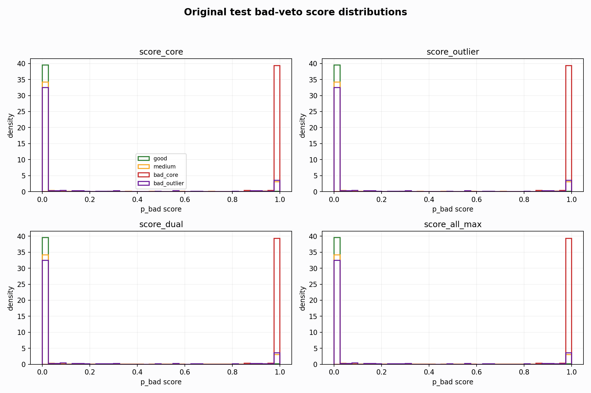
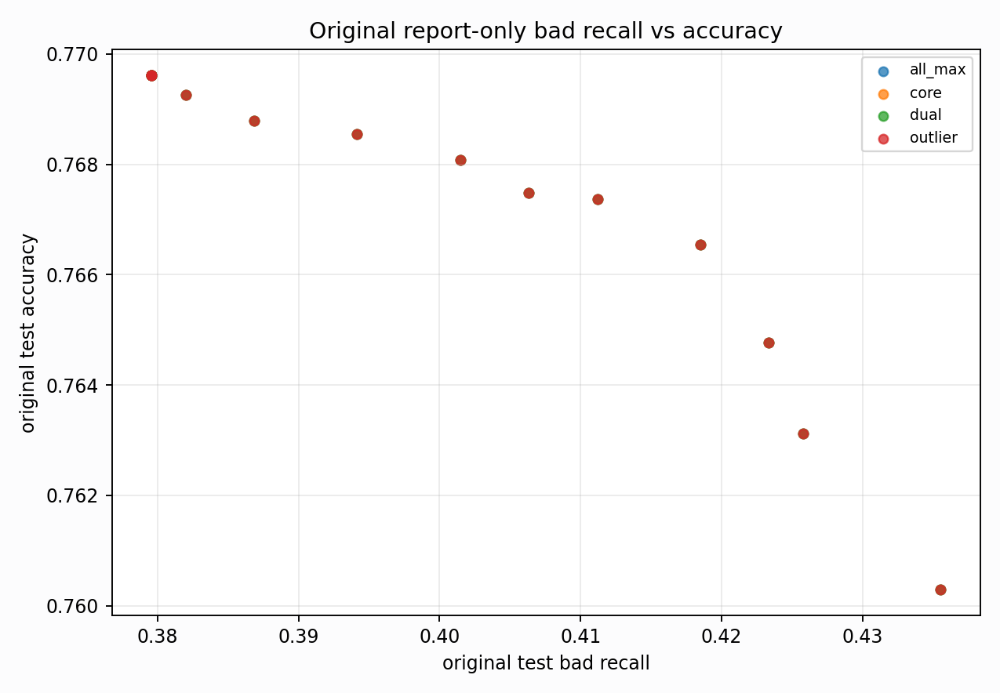

# Original Bad-Veto Tradeoff Analysis

Report-only. Original BUT is used here only to explain domain gaps, not for model selection.

## What This Tests

- Base prediction: `nl_n7186_gm_trim_bad_boundaryblocks_badoutlier_recall_gua_7cd9d3f2aac9` / `simple_pc1_gm_gate_t254`.
- Bad evidence: raw bad probabilities from `nl_n7186_gm_trim_bad_boundaryblocks_badoutlier_recall_gua_7cd9d3f2aac9`, `nl_n7186_gm_trim_bad_boundaryblocks_badoutlier_recall_gua_7cd9d3f2aac9`, `nl_n7186_gm_trim_bad_boundaryblocks_badoutlier_recall_gua_7cd9d3f2aac9`.
- Search space: a bad-score threshold plus optional one-feature gate (`pc1`, `pc2`, `pc3`, `qrs_visibility`).

## Top Balanced Report-Only Rules

| score_col | score_threshold | gate | gate_threshold | test_all_acc | test_all_good_recall | test_all_medium_recall | test_all_bad_recall | bad_core_bad_recall | bad_outlier_bad_recall | gm_false_bad_rate |
| --- | --- | --- | --- | --- | --- | --- | --- | --- | --- | --- |
| score_dual | 0.0100 | pc3__le | 2.1507 | 0.7636 | 0.9038 | 0.6787 | 0.4355 | 1.0000 | 0.2055 | 0.0900 |
| score_all_max | 0.0100 | pc3__le | 2.1507 | 0.7636 | 0.9038 | 0.6787 | 0.4355 | 1.0000 | 0.2055 | 0.0900 |
| score_core | 0.0100 | pc3__le | 2.1507 | 0.7636 | 0.9038 | 0.6787 | 0.4355 | 1.0000 | 0.2055 | 0.0900 |
| score_outlier | 0.0100 | pc3__le | 2.1507 | 0.7636 | 0.9038 | 0.6787 | 0.4355 | 1.0000 | 0.2055 | 0.0900 |
| score_dual | 0.0100 | pc3__le | 0.0403 | 0.7678 | 0.9041 | 0.6875 | 0.4258 | 1.0000 | 0.1918 | 0.0815 |
| score_all_max | 0.0100 | pc3__le | 0.0403 | 0.7678 | 0.9041 | 0.6875 | 0.4258 | 1.0000 | 0.1918 | 0.0815 |
| score_core | 0.0100 | pc3__le | 0.0403 | 0.7678 | 0.9041 | 0.6875 | 0.4258 | 1.0000 | 0.1918 | 0.0815 |
| score_outlier | 0.0100 | pc3__le | 0.0403 | 0.7678 | 0.9041 | 0.6875 | 0.4258 | 1.0000 | 0.1918 | 0.0815 |
| score_dual | 0.0100 | pc1__le | -0.7734 | 0.7623 | 0.9038 | 0.6762 | 0.4355 | 1.0000 | 0.2055 | 0.0919 |
| score_all_max | 0.0100 | pc1__le | -0.7734 | 0.7623 | 0.9038 | 0.6762 | 0.4355 | 1.0000 | 0.2055 | 0.0919 |
| score_core | 0.0100 | pc1__le | -0.7734 | 0.7623 | 0.9038 | 0.6762 | 0.4355 | 1.0000 | 0.2055 | 0.0919 |
| score_outlier | 0.0100 | pc1__le | -0.7734 | 0.7623 | 0.9038 | 0.6762 | 0.4355 | 1.0000 | 0.2055 | 0.0919 |
| score_dual | 0.0100 | pc1__le | 0.1571 | 0.7611 | 0.9038 | 0.6740 | 0.4355 | 1.0000 | 0.2055 | 0.0931 |
| score_all_max | 0.0100 | pc1__le | 0.1571 | 0.7611 | 0.9038 | 0.6740 | 0.4355 | 1.0000 | 0.2055 | 0.0931 |
| score_core | 0.0100 | pc1__le | 0.1571 | 0.7611 | 0.9038 | 0.6740 | 0.4355 | 1.0000 | 0.2055 | 0.0931 |

## Highest Bad Recall Rules

| score_col | score_threshold | gate | gate_threshold | test_all_acc | test_all_good_recall | test_all_medium_recall | test_all_bad_recall | bad_core_bad_recall | bad_outlier_bad_recall | gm_false_bad_rate |
| --- | --- | --- | --- | --- | --- | --- | --- | --- | --- | --- |
| score_dual | 0.0100 | pc3__le | 2.1507 | 0.7636 | 0.9038 | 0.6787 | 0.4355 | 1.0000 | 0.2055 | 0.0900 |
| score_all_max | 0.0100 | pc3__le | 2.1507 | 0.7636 | 0.9038 | 0.6787 | 0.4355 | 1.0000 | 0.2055 | 0.0900 |
| score_core | 0.0100 | pc3__le | 2.1507 | 0.7636 | 0.9038 | 0.6787 | 0.4355 | 1.0000 | 0.2055 | 0.0900 |
| score_outlier | 0.0100 | pc3__le | 2.1507 | 0.7636 | 0.9038 | 0.6787 | 0.4355 | 1.0000 | 0.2055 | 0.0900 |
| score_dual | 0.0100 | pc1__le | -0.7734 | 0.7623 | 0.9038 | 0.6762 | 0.4355 | 1.0000 | 0.2055 | 0.0919 |
| score_all_max | 0.0100 | pc1__le | -0.7734 | 0.7623 | 0.9038 | 0.6762 | 0.4355 | 1.0000 | 0.2055 | 0.0919 |
| score_core | 0.0100 | pc1__le | -0.7734 | 0.7623 | 0.9038 | 0.6762 | 0.4355 | 1.0000 | 0.2055 | 0.0919 |
| score_outlier | 0.0100 | pc1__le | -0.7734 | 0.7623 | 0.9038 | 0.6762 | 0.4355 | 1.0000 | 0.2055 | 0.0919 |
| score_dual | 0.0100 | pc1__le | 0.1571 | 0.7611 | 0.9038 | 0.6740 | 0.4355 | 1.0000 | 0.2055 | 0.0931 |
| score_all_max | 0.0100 | pc1__le | 0.1571 | 0.7611 | 0.9038 | 0.6740 | 0.4355 | 1.0000 | 0.2055 | 0.0931 |
| score_core | 0.0100 | pc1__le | 0.1571 | 0.7611 | 0.9038 | 0.6740 | 0.4355 | 1.0000 | 0.2055 | 0.0931 |
| score_outlier | 0.0100 | pc1__le | 0.1571 | 0.7611 | 0.9038 | 0.6740 | 0.4355 | 1.0000 | 0.2055 | 0.0931 |
| score_dual | 0.0100 | pc3__le | 3.2812 | 0.7606 | 0.9038 | 0.6731 | 0.4355 | 1.0000 | 0.2055 | 0.0936 |
| score_all_max | 0.0100 | pc3__le | 3.2812 | 0.7606 | 0.9038 | 0.6731 | 0.4355 | 1.0000 | 0.2055 | 0.0936 |
| score_core | 0.0100 | pc3__le | 3.2812 | 0.7606 | 0.9038 | 0.6731 | 0.4355 | 1.0000 | 0.2055 | 0.0936 |

## Accuracy-Preserving Rules With Bad Recall >= 0.30

| score_col | score_threshold | gate | gate_threshold | test_all_acc | test_all_good_recall | test_all_medium_recall | test_all_bad_recall | bad_core_bad_recall | bad_outlier_bad_recall | gm_false_bad_rate |
| --- | --- | --- | --- | --- | --- | --- | --- | --- | --- | --- |
| score_all_max | 0.1500 | pc3__le | 0.0403 | 0.7701 | 0.9115 | 0.6880 | 0.4015 | 1.0000 | 0.1575 | 0.0686 |
| score_dual | 0.0800 | pc3__le | 0.0403 | 0.7701 | 0.9107 | 0.6880 | 0.4088 | 1.0000 | 0.1678 | 0.0710 |
| score_all_max | 0.0800 | pc3__le | 0.0403 | 0.7701 | 0.9107 | 0.6880 | 0.4088 | 1.0000 | 0.1678 | 0.0710 |
| score_core | 0.0800 | pc3__le | 0.0403 | 0.7701 | 0.9107 | 0.6880 | 0.4088 | 1.0000 | 0.1678 | 0.0710 |
| score_outlier | 0.0800 | pc3__le | 0.0403 | 0.7701 | 0.9107 | 0.6880 | 0.4088 | 1.0000 | 0.1678 | 0.0710 |
| score_dual | 0.1500 | pc3__le | 0.0403 | 0.7701 | 0.9115 | 0.6880 | 0.4015 | 1.0000 | 0.1575 | 0.0686 |
| score_core | 0.1500 | pc3__le | 0.0403 | 0.7701 | 0.9115 | 0.6880 | 0.4015 | 1.0000 | 0.1575 | 0.0686 |
| score_outlier | 0.1500 | pc3__le | 0.0403 | 0.7701 | 0.9115 | 0.6880 | 0.4015 | 1.0000 | 0.1575 | 0.0686 |
| score_outlier | 0.1500 | pc1__le | -3.4616 | 0.7700 | 0.9115 | 0.6882 | 0.3966 | 1.0000 | 0.1507 | 0.0679 |
| score_dual | 0.1500 | pc1__le | -3.4616 | 0.7700 | 0.9115 | 0.6882 | 0.3966 | 1.0000 | 0.1507 | 0.0679 |

## Score Distribution Summary

| score_col | bucket | n | mean | p50 | p75 | p90 | p95 | p99 |
| --- | --- | --- | --- | --- | --- | --- | --- | --- |
| score_core | bad_core | 119 | 0.9972 | 0.9998 | 0.9999 | 1.0000 | 1.0000 | 1.0000 |
| score_core | bad_outlier | 292 | 0.1307 | 0.0002 | 0.0049 | 0.9201 | 0.9986 | 1.0000 |
| score_core | good | 3640 | 0.0069 | 0.0000 | 0.0000 | 0.0001 | 0.0006 | 0.0508 |
| score_core | medium | 4426 | 0.1095 | 0.0000 | 0.0003 | 0.7352 | 0.9981 | 1.0000 |
| score_outlier | bad_core | 119 | 0.9972 | 0.9998 | 0.9999 | 1.0000 | 1.0000 | 1.0000 |
| score_outlier | bad_outlier | 292 | 0.1307 | 0.0002 | 0.0049 | 0.9201 | 0.9986 | 1.0000 |
| score_outlier | good | 3640 | 0.0069 | 0.0000 | 0.0000 | 0.0001 | 0.0006 | 0.0508 |
| score_outlier | medium | 4426 | 0.1095 | 0.0000 | 0.0003 | 0.7352 | 0.9981 | 1.0000 |
| score_dual | bad_core | 119 | 0.9972 | 0.9998 | 0.9999 | 1.0000 | 1.0000 | 1.0000 |
| score_dual | bad_outlier | 292 | 0.1307 | 0.0002 | 0.0049 | 0.9201 | 0.9986 | 1.0000 |
| score_dual | good | 3640 | 0.0069 | 0.0000 | 0.0000 | 0.0001 | 0.0006 | 0.0508 |
| score_dual | medium | 4426 | 0.1095 | 0.0000 | 0.0003 | 0.7352 | 0.9981 | 1.0000 |
| score_all_max | bad_core | 119 | 0.9972 | 0.9998 | 0.9999 | 1.0000 | 1.0000 | 1.0000 |
| score_all_max | bad_outlier | 292 | 0.1307 | 0.0002 | 0.0049 | 0.9201 | 0.9986 | 1.0000 |
| score_all_max | good | 3640 | 0.0069 | 0.0000 | 0.0000 | 0.0001 | 0.0006 | 0.0508 |
| score_all_max | medium | 4426 | 0.1095 | 0.0000 | 0.0003 | 0.7352 | 0.9981 | 1.0000 |

## Interpretation

- Clean/node split says the bad specialist is useful; original says the same score is miscalibrated and sweeps many good/medium rows into bad.
- A simple bad-veto branch is promising, but the original threshold needs either domain calibration or a second simple geometry gate.
- The next training-side experiment should therefore be a decoupled bad-veto/head-style objective, not another broad class-weight sweep.

