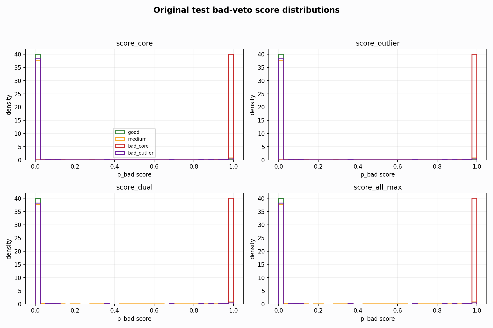
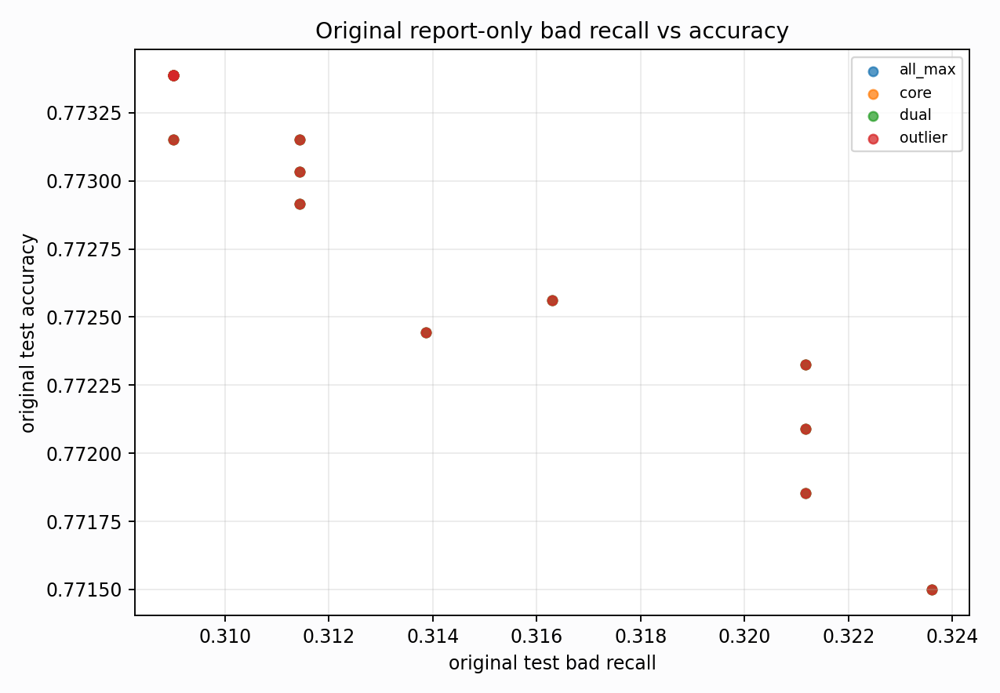

# Original Bad-Veto Tradeoff Analysis

Report-only. Original BUT is used here only to explain domain gaps, not for model selection.

## What This Tests

- Base prediction: `nl_n7187_gm_trim_bad_boundaryblocks_badoutlier_detail_pus_e71b4ab0102f` / `simple_pc1_gm_gate_t254`.
- Bad evidence: raw bad probabilities from `nl_n7187_gm_trim_bad_boundaryblocks_badoutlier_detail_pus_e71b4ab0102f`, `nl_n7187_gm_trim_bad_boundaryblocks_badoutlier_detail_pus_e71b4ab0102f`, `nl_n7187_gm_trim_bad_boundaryblocks_badoutlier_detail_pus_e71b4ab0102f`.
- Search space: a bad-score threshold plus optional one-feature gate (`pc1`, `pc2`, `pc3`, `qrs_visibility`).

## Top Balanced Report-Only Rules

| score_col | score_threshold | gate | gate_threshold | test_all_acc | test_all_good_recall | test_all_medium_recall | test_all_bad_recall | bad_core_bad_recall | bad_outlier_bad_recall | gm_false_bad_rate |
| --- | --- | --- | --- | --- | --- | --- | --- | --- | --- | --- |
| score_dual | 0.0100 | qrs_visibility__le | 0.0181 | 0.7733 | 0.9176 | 0.6963 | 0.3236 | 1.0000 | 0.0479 | 0.0309 |
| score_all_max | 0.0100 | qrs_visibility__le | 0.0181 | 0.7733 | 0.9176 | 0.6963 | 0.3236 | 1.0000 | 0.0479 | 0.0309 |
| score_core | 0.0100 | qrs_visibility__le | 0.0181 | 0.7733 | 0.9176 | 0.6963 | 0.3236 | 1.0000 | 0.0479 | 0.0309 |
| score_outlier | 0.0100 | qrs_visibility__le | 0.0181 | 0.7733 | 0.9176 | 0.6963 | 0.3236 | 1.0000 | 0.0479 | 0.0309 |
| score_dual | 0.0100 | pc1__le | -0.7734 | 0.7728 | 0.9173 | 0.6957 | 0.3236 | 1.0000 | 0.0479 | 0.0342 |
| score_dual | 0.0100 | pc2__ge | 10.6167 | 0.7728 | 0.9173 | 0.6957 | 0.3236 | 1.0000 | 0.0479 | 0.0342 |
| score_dual | 0.0100 | qrs_visibility__le | 0.0525 | 0.7728 | 0.9173 | 0.6957 | 0.3236 | 1.0000 | 0.0479 | 0.0341 |
| score_all_max | 0.0100 | pc1__le | -0.7734 | 0.7728 | 0.9173 | 0.6957 | 0.3236 | 1.0000 | 0.0479 | 0.0342 |
| score_all_max | 0.0100 | pc2__ge | 10.6167 | 0.7728 | 0.9173 | 0.6957 | 0.3236 | 1.0000 | 0.0479 | 0.0342 |
| score_all_max | 0.0100 | qrs_visibility__le | 0.0525 | 0.7728 | 0.9173 | 0.6957 | 0.3236 | 1.0000 | 0.0479 | 0.0341 |
| score_core | 0.0100 | pc1__le | -0.7734 | 0.7728 | 0.9173 | 0.6957 | 0.3236 | 1.0000 | 0.0479 | 0.0342 |
| score_core | 0.0100 | pc2__ge | 10.6167 | 0.7728 | 0.9173 | 0.6957 | 0.3236 | 1.0000 | 0.0479 | 0.0342 |
| score_core | 0.0100 | qrs_visibility__le | 0.0525 | 0.7728 | 0.9173 | 0.6957 | 0.3236 | 1.0000 | 0.0479 | 0.0341 |
| score_outlier | 0.0100 | pc1__le | -0.7734 | 0.7728 | 0.9173 | 0.6957 | 0.3236 | 1.0000 | 0.0479 | 0.0342 |
| score_outlier | 0.0100 | pc2__ge | 10.6167 | 0.7728 | 0.9173 | 0.6957 | 0.3236 | 1.0000 | 0.0479 | 0.0342 |

## Highest Bad Recall Rules

| score_col | score_threshold | gate | gate_threshold | test_all_acc | test_all_good_recall | test_all_medium_recall | test_all_bad_recall | bad_core_bad_recall | bad_outlier_bad_recall | gm_false_bad_rate |
| --- | --- | --- | --- | --- | --- | --- | --- | --- | --- | --- |
| score_dual | 0.0100 | qrs_visibility__le | 0.0181 | 0.7733 | 0.9176 | 0.6963 | 0.3236 | 1.0000 | 0.0479 | 0.0309 |
| score_all_max | 0.0100 | qrs_visibility__le | 0.0181 | 0.7733 | 0.9176 | 0.6963 | 0.3236 | 1.0000 | 0.0479 | 0.0309 |
| score_core | 0.0100 | qrs_visibility__le | 0.0181 | 0.7733 | 0.9176 | 0.6963 | 0.3236 | 1.0000 | 0.0479 | 0.0309 |
| score_outlier | 0.0100 | qrs_visibility__le | 0.0181 | 0.7733 | 0.9176 | 0.6963 | 0.3236 | 1.0000 | 0.0479 | 0.0309 |
| score_dual | 0.0100 | pc1__le | -0.7734 | 0.7728 | 0.9173 | 0.6957 | 0.3236 | 1.0000 | 0.0479 | 0.0342 |
| score_dual | 0.0100 | pc2__ge | 10.6167 | 0.7728 | 0.9173 | 0.6957 | 0.3236 | 1.0000 | 0.0479 | 0.0342 |
| score_dual | 0.0100 | qrs_visibility__le | 0.0525 | 0.7728 | 0.9173 | 0.6957 | 0.3236 | 1.0000 | 0.0479 | 0.0341 |
| score_all_max | 0.0100 | pc1__le | -0.7734 | 0.7728 | 0.9173 | 0.6957 | 0.3236 | 1.0000 | 0.0479 | 0.0342 |
| score_all_max | 0.0100 | pc2__ge | 10.6167 | 0.7728 | 0.9173 | 0.6957 | 0.3236 | 1.0000 | 0.0479 | 0.0342 |
| score_all_max | 0.0100 | qrs_visibility__le | 0.0525 | 0.7728 | 0.9173 | 0.6957 | 0.3236 | 1.0000 | 0.0479 | 0.0341 |
| score_core | 0.0100 | pc1__le | -0.7734 | 0.7728 | 0.9173 | 0.6957 | 0.3236 | 1.0000 | 0.0479 | 0.0342 |
| score_core | 0.0100 | pc2__ge | 10.6167 | 0.7728 | 0.9173 | 0.6957 | 0.3236 | 1.0000 | 0.0479 | 0.0342 |
| score_core | 0.0100 | qrs_visibility__le | 0.0525 | 0.7728 | 0.9173 | 0.6957 | 0.3236 | 1.0000 | 0.0479 | 0.0341 |
| score_outlier | 0.0100 | pc1__le | -0.7734 | 0.7728 | 0.9173 | 0.6957 | 0.3236 | 1.0000 | 0.0479 | 0.0342 |
| score_outlier | 0.0100 | pc2__ge | 10.6167 | 0.7728 | 0.9173 | 0.6957 | 0.3236 | 1.0000 | 0.0479 | 0.0342 |

## Accuracy-Preserving Rules With Bad Recall >= 0.30

| score_col | score_threshold | gate | gate_threshold | test_all_acc | test_all_good_recall | test_all_medium_recall | test_all_bad_recall | bad_core_bad_recall | bad_outlier_bad_recall | gm_false_bad_rate |
| --- | --- | --- | --- | --- | --- | --- | --- | --- | --- | --- |
| score_outlier | 0.0800 | pc1__le | -3.4616 | 0.7736 | 0.9181 | 0.6972 | 0.3163 | 1.0000 | 0.0377 | 0.0274 |
| score_core | 0.0800 | pc1__le | -3.4616 | 0.7736 | 0.9181 | 0.6972 | 0.3163 | 1.0000 | 0.0377 | 0.0274 |
| score_all_max | 0.0800 | pc1__le | -3.4616 | 0.7736 | 0.9181 | 0.6972 | 0.3163 | 1.0000 | 0.0377 | 0.0274 |
| score_dual | 0.0800 | pc1__le | -3.4616 | 0.7736 | 0.9181 | 0.6972 | 0.3163 | 1.0000 | 0.0377 | 0.0274 |
| score_outlier | 0.2000 | pc1__le | -3.4616 | 0.7735 | 0.9184 | 0.6972 | 0.3114 | 1.0000 | 0.0308 | 0.0247 |
| score_outlier | 0.2000 | pc3__le | -2.4479 | 0.7735 | 0.9184 | 0.6972 | 0.3114 | 1.0000 | 0.0308 | 0.0234 |
| score_outlier | 0.2000 | pc3__le | -1.6105 | 0.7735 | 0.9184 | 0.6972 | 0.3114 | 1.0000 | 0.0308 | 0.0239 |
| score_outlier | 0.3000 | pc1__le | -6.0990 | 0.7735 | 0.9184 | 0.6972 | 0.3114 | 1.0000 | 0.0308 | 0.0217 |
| score_core | 0.3000 | pc3__le | -2.4479 | 0.7735 | 0.9184 | 0.6972 | 0.3114 | 1.0000 | 0.0308 | 0.0226 |
| score_core | 0.3000 | pc3__le | -1.6105 | 0.7735 | 0.9184 | 0.6972 | 0.3114 | 1.0000 | 0.0308 | 0.0227 |

## Score Distribution Summary

| score_col | bucket | n | mean | p50 | p75 | p90 | p95 | p99 |
| --- | --- | --- | --- | --- | --- | --- | --- | --- |
| score_core | bad_core | 119 | 1.0000 | 1.0000 | 1.0000 | 1.0000 | 1.0000 | 1.0000 |
| score_core | bad_outlier | 292 | 0.0275 | 0.0000 | 0.0000 | 0.0000 | 0.0057 | 0.9658 |
| score_core | good | 3640 | 0.0006 | 0.0000 | 0.0000 | 0.0000 | 0.0000 | 0.0000 |
| score_core | medium | 4426 | 0.0381 | 0.0000 | 0.0000 | 0.0002 | 0.0963 | 0.9968 |
| score_outlier | bad_core | 119 | 1.0000 | 1.0000 | 1.0000 | 1.0000 | 1.0000 | 1.0000 |
| score_outlier | bad_outlier | 292 | 0.0275 | 0.0000 | 0.0000 | 0.0000 | 0.0057 | 0.9658 |
| score_outlier | good | 3640 | 0.0006 | 0.0000 | 0.0000 | 0.0000 | 0.0000 | 0.0000 |
| score_outlier | medium | 4426 | 0.0381 | 0.0000 | 0.0000 | 0.0002 | 0.0963 | 0.9968 |
| score_dual | bad_core | 119 | 1.0000 | 1.0000 | 1.0000 | 1.0000 | 1.0000 | 1.0000 |
| score_dual | bad_outlier | 292 | 0.0275 | 0.0000 | 0.0000 | 0.0000 | 0.0057 | 0.9658 |
| score_dual | good | 3640 | 0.0006 | 0.0000 | 0.0000 | 0.0000 | 0.0000 | 0.0000 |
| score_dual | medium | 4426 | 0.0381 | 0.0000 | 0.0000 | 0.0002 | 0.0963 | 0.9968 |
| score_all_max | bad_core | 119 | 1.0000 | 1.0000 | 1.0000 | 1.0000 | 1.0000 | 1.0000 |
| score_all_max | bad_outlier | 292 | 0.0275 | 0.0000 | 0.0000 | 0.0000 | 0.0057 | 0.9658 |
| score_all_max | good | 3640 | 0.0006 | 0.0000 | 0.0000 | 0.0000 | 0.0000 | 0.0000 |
| score_all_max | medium | 4426 | 0.0381 | 0.0000 | 0.0000 | 0.0002 | 0.0963 | 0.9968 |

## Interpretation

- Clean/node split says the bad specialist is useful; original says the same score is miscalibrated and sweeps many good/medium rows into bad.
- A simple bad-veto branch is promising, but the original threshold needs either domain calibration or a second simple geometry gate.
- The next training-side experiment should therefore be a decoupled bad-veto/head-style objective, not another broad class-weight sweep.

