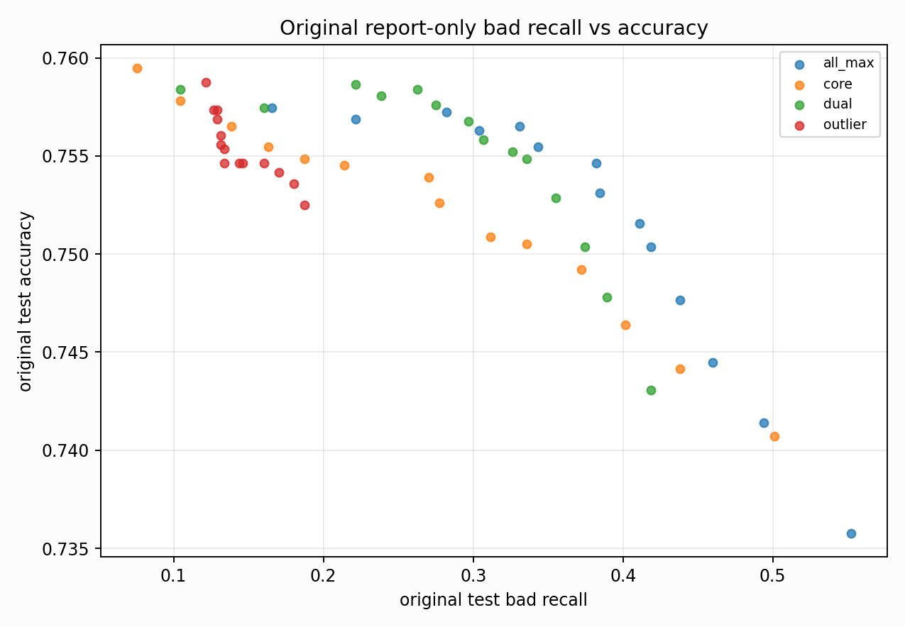

# Original Bad-Veto Tradeoff Analysis

Report-only. Original BUT is used here only to explain domain gaps, not for model selection.

## What This Tests

- Base good/medium prediction: N7180 `simple_pc1_gm_gate_t254`.
- Bad evidence: raw bad probabilities from N7182 core/outlier/dual bad specialists.
- Search space: a bad-score threshold plus optional one-feature gate (`pc1`, `pc2`, `pc3`, `qrs_visibility`).

## Top Balanced Report-Only Rules

| score_col | score_threshold | gate | gate_threshold | test_all_acc | test_all_good_recall | test_all_medium_recall | test_all_bad_recall | bad_core_bad_recall | bad_outlier_bad_recall | gm_false_bad_rate |
| --- | --- | --- | --- | --- | --- | --- | --- | --- | --- | --- |
| score_all_max | 0.0100 | pc3__le | 2.1507 | 0.7535 | 0.8854 | 0.6638 | 0.5499 | 0.9916 | 0.3699 | 0.1333 |
| score_all_max | 0.0100 | pc3__le | 3.2812 | 0.7375 | 0.8854 | 0.6331 | 0.5523 | 0.9916 | 0.3733 | 0.1510 |
| score_all_max | 0.0100 | qrs_visibility__le | 0.2801 | 0.7361 | 0.8860 | 0.6299 | 0.5523 | 0.9916 | 0.3733 | 0.1525 |
| score_all_max | 0.0100 | qrs_visibility__le | 0.3732 | 0.7361 | 0.8860 | 0.6299 | 0.5523 | 0.9916 | 0.3733 | 0.1525 |
| score_all_max | 0.0100 | none |  | 0.7358 | 0.8854 | 0.6297 | 0.5523 | 0.9916 | 0.3733 | 0.1529 |
| score_core | 0.0100 | pc3__le | 2.1507 | 0.7546 | 0.8896 | 0.6674 | 0.4988 | 0.9748 | 0.3048 | 0.1185 |
| score_all_max | 0.0200 | pc3__le | 2.1507 | 0.7556 | 0.8904 | 0.6692 | 0.4915 | 0.9412 | 0.3082 | 0.1221 |
| score_core | 0.0100 | pc3__le | 3.2812 | 0.7420 | 0.8896 | 0.6430 | 0.5012 | 0.9748 | 0.3082 | 0.1327 |
| score_all_max | 0.0100 | pc1__ge | -6.0990 | 0.7347 | 0.8876 | 0.6297 | 0.5109 | 0.9916 | 0.3151 | 0.1384 |
| score_core | 0.0100 | qrs_visibility__le | 0.2801 | 0.7409 | 0.8901 | 0.6405 | 0.5012 | 0.9748 | 0.3082 | 0.1338 |
| score_core | 0.0100 | qrs_visibility__le | 0.3732 | 0.7409 | 0.8901 | 0.6405 | 0.5012 | 0.9748 | 0.3082 | 0.1338 |
| score_core | 0.0100 | none |  | 0.7407 | 0.8896 | 0.6405 | 0.5012 | 0.9748 | 0.3082 | 0.1340 |
| score_all_max | 0.0200 | pc3__le | 3.2812 | 0.7427 | 0.8904 | 0.6444 | 0.4939 | 0.9412 | 0.3116 | 0.1366 |
| score_all_max | 0.0200 | qrs_visibility__le | 0.2801 | 0.7415 | 0.8907 | 0.6419 | 0.4939 | 0.9412 | 0.3116 | 0.1379 |
| score_all_max | 0.0200 | qrs_visibility__le | 0.3732 | 0.7415 | 0.8907 | 0.6419 | 0.4939 | 0.9412 | 0.3116 | 0.1379 |

## Highest Bad Recall Rules

| score_col | score_threshold | gate | gate_threshold | test_all_acc | test_all_good_recall | test_all_medium_recall | test_all_bad_recall | bad_core_bad_recall | bad_outlier_bad_recall | gm_false_bad_rate |
| --- | --- | --- | --- | --- | --- | --- | --- | --- | --- | --- |
| score_all_max | 0.0100 | pc3__le | 3.2812 | 0.7375 | 0.8854 | 0.6331 | 0.5523 | 0.9916 | 0.3733 | 0.1510 |
| score_all_max | 0.0100 | qrs_visibility__le | 0.2801 | 0.7361 | 0.8860 | 0.6299 | 0.5523 | 0.9916 | 0.3733 | 0.1525 |
| score_all_max | 0.0100 | qrs_visibility__le | 0.3732 | 0.7361 | 0.8860 | 0.6299 | 0.5523 | 0.9916 | 0.3733 | 0.1525 |
| score_all_max | 0.0100 | none |  | 0.7358 | 0.8854 | 0.6297 | 0.5523 | 0.9916 | 0.3733 | 0.1529 |
| score_all_max | 0.0100 | pc3__le | 2.1507 | 0.7535 | 0.8854 | 0.6638 | 0.5499 | 0.9916 | 0.3699 | 0.1333 |
| score_all_max | 0.0100 | pc1__ge | -6.0990 | 0.7347 | 0.8876 | 0.6297 | 0.5109 | 0.9916 | 0.3151 | 0.1384 |
| score_core | 0.0100 | pc3__le | 3.2812 | 0.7420 | 0.8896 | 0.6430 | 0.5012 | 0.9748 | 0.3082 | 0.1327 |
| score_core | 0.0100 | qrs_visibility__le | 0.2801 | 0.7409 | 0.8901 | 0.6405 | 0.5012 | 0.9748 | 0.3082 | 0.1338 |
| score_core | 0.0100 | qrs_visibility__le | 0.3732 | 0.7409 | 0.8901 | 0.6405 | 0.5012 | 0.9748 | 0.3082 | 0.1338 |
| score_core | 0.0100 | none |  | 0.7407 | 0.8896 | 0.6405 | 0.5012 | 0.9748 | 0.3082 | 0.1340 |
| score_core | 0.0100 | pc3__le | 2.1507 | 0.7546 | 0.8896 | 0.6674 | 0.4988 | 0.9748 | 0.3048 | 0.1185 |
| score_all_max | 0.0200 | pc3__le | 3.2812 | 0.7427 | 0.8904 | 0.6444 | 0.4939 | 0.9412 | 0.3116 | 0.1366 |
| score_all_max | 0.0200 | qrs_visibility__le | 0.2801 | 0.7415 | 0.8907 | 0.6419 | 0.4939 | 0.9412 | 0.3116 | 0.1379 |
| score_all_max | 0.0200 | qrs_visibility__le | 0.3732 | 0.7415 | 0.8907 | 0.6419 | 0.4939 | 0.9412 | 0.3116 | 0.1379 |
| score_all_max | 0.0200 | none |  | 0.7414 | 0.8904 | 0.6419 | 0.4939 | 0.9412 | 0.3116 | 0.1380 |

## Accuracy-Preserving Rules With Bad Recall >= 0.30

| score_col | score_threshold | gate | gate_threshold | test_all_acc | test_all_good_recall | test_all_medium_recall | test_all_bad_recall | bad_core_bad_recall | bad_outlier_bad_recall | gm_false_bad_rate |
| --- | --- | --- | --- | --- | --- | --- | --- | --- | --- | --- |
| score_all_max | 0.0300 | pc2__le | 10.6167 | 0.7681 | 0.9170 | 0.6884 | 0.3066 | 0.9244 | 0.0548 | 0.0103 |
| score_dual | 0.0100 | pc2__le | 10.6167 | 0.7678 | 0.9173 | 0.6882 | 0.3017 | 0.9580 | 0.0342 | 0.0104 |
| score_all_max | 0.0200 | pc2__le | 10.6167 | 0.7669 | 0.9165 | 0.6855 | 0.3187 | 0.9412 | 0.0651 | 0.0124 |
| score_core | 0.0100 | pc2__le | 10.6167 | 0.7663 | 0.9170 | 0.6828 | 0.3309 | 0.9748 | 0.0685 | 0.0124 |
| score_dual | 0.0100 | qrs_visibility__ge | 0.0525 | 0.7656 | 0.9063 | 0.6930 | 0.3017 | 0.9580 | 0.0342 | 0.0161 |
| score_all_max | 0.0100 | pc2__le | 10.6167 | 0.7638 | 0.9162 | 0.6769 | 0.3504 | 0.9916 | 0.0890 | 0.0177 |
| score_all_max | 0.0200 | qrs_visibility__ge | 0.0525 | 0.7634 | 0.9041 | 0.6898 | 0.3090 | 0.9412 | 0.0514 | 0.0195 |
| score_all_max | 0.4000 | pc3__le | 2.1507 | 0.7634 | 0.9082 | 0.6844 | 0.3309 | 0.7227 | 0.1712 | 0.0839 |
| score_dual | 0.1000 | pc3__le | 2.1507 | 0.7632 | 0.9099 | 0.6832 | 0.3260 | 0.7983 | 0.1336 | 0.0782 |
| score_dual | 0.0800 | pc3__le | 2.1507 | 0.7632 | 0.9093 | 0.6828 | 0.3358 | 0.8235 | 0.1370 | 0.0810 |

## Score Distribution Summary

| score_col | bucket | n | mean | p50 | p75 | p90 | p95 | p99 |
| --- | --- | --- | --- | --- | --- | --- | --- | --- |
| score_core | bad_core | 119 | 0.3278 | 0.2421 | 0.5615 | 0.7874 | 0.8945 | 0.9919 |
| score_core | bad_outlier | 292 | 0.1082 | 0.0015 | 0.0195 | 0.4012 | 0.9897 | 0.9995 |
| score_core | good | 3640 | 0.0097 | 0.0000 | 0.0000 | 0.0003 | 0.0023 | 0.3196 |
| score_core | medium | 4426 | 0.1172 | 0.0000 | 0.0036 | 0.6904 | 0.9833 | 0.9999 |
| score_outlier | bad_core | 119 | 0.0001 | 0.0000 | 0.0000 | 0.0000 | 0.0001 | 0.0007 |
| score_outlier | bad_outlier | 292 | 0.1589 | 0.0001 | 0.0064 | 0.9992 | 1.0000 | 1.0000 |
| score_outlier | good | 3640 | 0.0052 | 0.0000 | 0.0000 | 0.0000 | 0.0002 | 0.0044 |
| score_outlier | medium | 4426 | 0.1251 | 0.0000 | 0.0002 | 0.9789 | 0.9999 | 1.0000 |
| score_dual | bad_core | 119 | 0.5168 | 0.5910 | 0.8644 | 0.9718 | 0.9872 | 0.9929 |
| score_dual | bad_outlier | 292 | 0.1011 | 0.0004 | 0.0032 | 0.3978 | 0.9921 | 0.9993 |
| score_dual | good | 3640 | 0.0067 | 0.0000 | 0.0001 | 0.0004 | 0.0020 | 0.1186 |
| score_dual | medium | 4426 | 0.1178 | 0.0000 | 0.0024 | 0.7716 | 0.9911 | 0.9995 |
| score_all_max | bad_core | 119 | 0.5784 | 0.6390 | 0.8814 | 0.9783 | 0.9879 | 0.9976 |
| score_all_max | bad_outlier | 292 | 0.1742 | 0.0028 | 0.0438 | 0.9995 | 1.0000 | 1.0000 |
| score_all_max | good | 3640 | 0.0127 | 0.0000 | 0.0001 | 0.0010 | 0.0042 | 0.5770 |
| score_all_max | medium | 4426 | 0.1565 | 0.0001 | 0.0097 | 0.9921 | 1.0000 | 1.0000 |

## Interpretation

- Clean/node split says the bad specialist is useful; original says the same score is miscalibrated and sweeps many good/medium rows into bad.
- A simple bad-veto branch is promising, but the original threshold needs either domain calibration or a second simple geometry gate.
- The next training-side experiment should therefore be a decoupled bad-veto/head-style objective, not another broad class-weight sweep.

