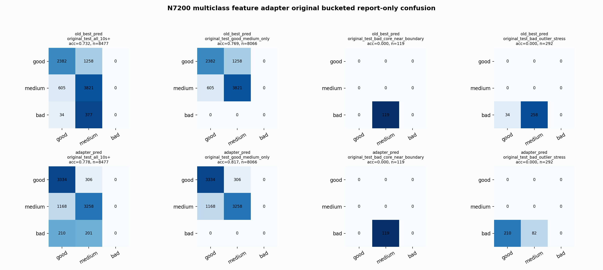

# N7200 Multiclass Feature Adapter Original Bucketed Report

Report-only evaluation. Original BUT is not used for Clean/SemiClean/node selection.

## Artifact

- Adapter: `adapter_n7200_multiclass_features_rf_multiclass_depth5_balanced`
- Model path: `E:\GPTProject2\ecg\outputs\external_benchmarks\e311_but_node_ladder_tuning_10s_2026_06_08\analysis\good_medium_geometry_repair\n7200_multiclass_feature_adapter_rf_multiclass_depth5_balanced.pkl`
- Base: `nl_n7200_gm_trim_bad_goodlike_aux_tail_a12_good124_mid172_ec4f54fe7e3d` / `medium_guarded_pmed0005`
- Adapter can output good, medium, or bad.

## Buckets

- `original_all_10s+`: adapter acc=0.8469 (base=0.8124), macro-F1=0.8652, recall good/medium/bad=0.8267/0.8489/0.9080, flips=5946, fixed=3451, lost=2315
- `original_test_all_10s+`: adapter acc=0.7776 (base=0.7317), macro-F1=0.5313, recall good/medium/bad=0.9159/0.7361/0.0000, flips=2531, fixed=1371, lost=982
- `original_test_good_medium_only`: adapter acc=0.8173 (base=0.7690), macro-F1=0.5448, recall good/medium/bad=0.9159/0.7361/0.0000, flips=2353, fixed=1371, lost=982
- `original_test_bad_core_near_boundary`: adapter acc=0.0000 (base=0.0000), macro-F1=0.0000, recall good/medium/bad=0.0000/0.0000/0.0000, flips=0, fixed=0, lost=0
- `original_test_bad_outlier_stress`: adapter acc=0.0000 (base=0.0000), macro-F1=0.0000, recall good/medium/bad=0.0000/0.0000/0.0000, flips=178, fixed=0, lost=0
- `original_test_drop_bad_outlier_reference`: adapter acc=0.8054 (base=0.7578), macro-F1=0.5408, recall good/medium/bad=0.9159/0.7361/0.0000, flips=2353, fixed=1371, lost=982
- `original_test_good_medium_overlap`: adapter acc=0.8033 (base=0.7535), macro-F1=0.5347, recall good/medium/bad=0.9150/0.6997/0.0000, flips=2337, fixed=1355, lost=982
- `original_all_bad_core_near_boundary`: adapter acc=0.9706 (base=0.9706), macro-F1=0.3284, recall good/medium/bad=0.0000/0.0000/0.9706, flips=0, fixed=0, lost=0
- `original_all_bad_outlier_stress`: adapter acc=0.6953 (base=0.6953), macro-F1=0.2734, recall good/medium/bad=0.0000/0.0000/0.6953, flips=180, fixed=0, lost=0

## Counts

- Original all 10s+: `32956` windows.
- Original test 10s+: `8477` windows.

