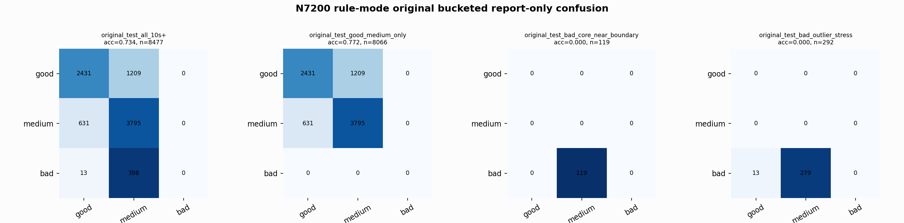

# N7200 Rule-Mode Original Bucketed Report

Report-only evaluation. It is not used for Clean/SemiClean/node selection.

## Rule Artifact

- Artifact: `rule_n7200_gm_trim_bad_qrslow_bisect_2839a07720c5_942f7f261b19`
- Base: `nl_n7200_gm_trim_bad_geom_stack_n7000_g008_m044_g115_m184_2839a07720c5` / `medium_guarded_pmed0005`
- Alt: `nl_n7200_gm_trim_bad_geom_tri_atlaspc2_matchold_g002_m006_942f7f261b19` / `medium_guarded_pmed0005`
- Gate: when endpoints disagree good-vs-medium and `qrs_visibility <= 0.53027088`, use alt; otherwise use base.

## Buckets

- `original_all_10s+`: n=32956, acc=0.8317, macro-F1=0.8537, recall good/medium/bad=0.7899/0.8605/0.9084, gate flips=2919, fixed=1416, lost=1481
- `original_test_all_10s+`: n=8477, acc=0.7345, macro-F1=0.4988, recall good/medium/bad=0.6679/0.8574/0.0000, gate flips=858, fixed=293, lost=543
- `original_test_good_medium_only`: n=8066, acc=0.7719, macro-F1=0.5101, recall good/medium/bad=0.6679/0.8574/0.0000, gate flips=836, fixed=293, lost=543
- `original_test_bad_core_near_boundary`: n=119, acc=0.0000, macro-F1=0.0000, recall good/medium/bad=0.0000/0.0000/0.0000, gate flips=0, fixed=0, lost=0
- `original_test_bad_outlier_stress`: n=292, acc=0.0000, macro-F1=0.0000, recall good/medium/bad=0.0000/0.0000/0.0000, gate flips=22, fixed=0, lost=0
- `original_test_drop_bad_outlier_reference`: n=8185, acc=0.7607, macro-F1=0.5068, recall good/medium/bad=0.6679/0.8574/0.0000, gate flips=836, fixed=293, lost=543
- `original_test_good_medium_overlap`: n=7492, acc=0.7571, macro-F1=0.5024, recall good/medium/bad=0.6644/0.8429/0.0000, gate flips=827, fixed=290, lost=537
- `original_all_bad_core_near_boundary`: n=4084, acc=0.9709, macro-F1=0.3284, recall good/medium/bad=0.0000/0.0000/0.9709, gate flips=0, fixed=0, lost=0
- `original_all_bad_outlier_stress`: n=1201, acc=0.6961, macro-F1=0.2736, recall good/medium/bad=0.0000/0.0000/0.6961, gate flips=22, fixed=0, lost=0

## Counts

- Original all 10s+: `32956` windows.
- Original test 10s+: `8477` windows.
- Bad outlier stress is reported separately because dropping it removes most original-test bad windows.

