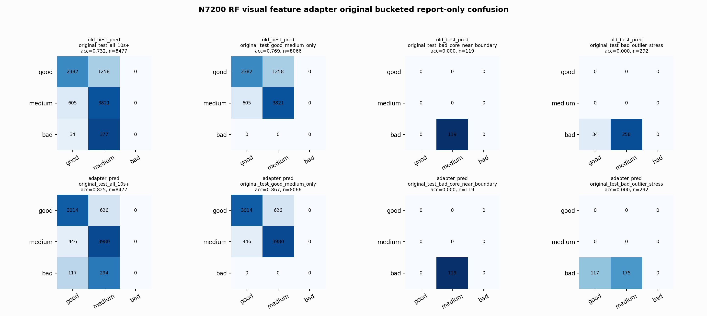

# N7200 RF Visual Feature Adapter Original Bucketed Report

Report-only evaluation. Original BUT is not used for Clean/SemiClean/node selection.

## Artifact

- Adapter: `adapter_n7200_visual_features_rf_depth4_balanced`
- Model path: `E:\GPTProject2\ecg\outputs\external_benchmarks\e311_but_node_ladder_tuning_10s_2026_06_08\analysis\good_medium_geometry_repair\n7200_visual_feature_adapter_rf_depth4_balanced.pkl`
- Base: `nl_n7200_gm_trim_bad_goodlike_aux_tail_a12_good124_mid172_ec4f54fe7e3d` / `medium_guarded_pmed0005`
- Fixed adapter threshold from Clean/SemiClean validation: `0.5300`
- Adapter edits only base good/medium predictions; base bad predictions are left unchanged.

## Fixed-Threshold Buckets

- `original_all_10s+`: adapter acc=0.8513 (base=0.8124), macro-F1=0.8706, recall good/medium/bad=0.7887/0.9235/0.9080, flips=4667, fixed=2931, lost=1649
- `original_test_all_10s+`: adapter acc=0.8251 (base=0.7317), macro-F1=0.5629, recall good/medium/bad=0.8280/0.8992/0.0000, flips=1420, fixed=1063, lost=272
- `original_test_good_medium_only`: adapter acc=0.8671 (base=0.7690), macro-F1=0.5768, recall good/medium/bad=0.8280/0.8992/0.0000, flips=1335, fixed=1063, lost=272
- `original_test_bad_core_near_boundary`: adapter acc=0.0000 (base=0.0000), macro-F1=0.0000, recall good/medium/bad=0.0000/0.0000/0.0000, flips=0, fixed=0, lost=0
- `original_test_bad_outlier_stress`: adapter acc=0.0000 (base=0.0000), macro-F1=0.0000, recall good/medium/bad=0.0000/0.0000/0.0000, flips=85, fixed=0, lost=0
- `original_test_drop_bad_outlier_reference`: adapter acc=0.8545 (base=0.7578), macro-F1=0.5730, recall good/medium/bad=0.8280/0.8992/0.0000, flips=1335, fixed=1063, lost=272
- `original_test_good_medium_overlap`: adapter acc=0.8569 (base=0.7535), macro-F1=0.5709, recall good/medium/bad=0.8262/0.8853/0.0000, flips=1319, fixed=1047, lost=272
- `original_all_bad_core_near_boundary`: adapter acc=0.9706 (base=0.9706), macro-F1=0.3284, recall good/medium/bad=0.0000/0.0000/0.9706, flips=0, fixed=0, lost=0
- `original_all_bad_outlier_stress`: adapter acc=0.6953 (base=0.6953), macro-F1=0.2734, recall good/medium/bad=0.0000/0.0000/0.6953, flips=87, fixed=0, lost=0

## Original-Test Threshold Sweep

This sweep uses original labels only as a report-only diagnostic. It is an oracle check for transfer/calibration, not a selection procedure.

```
 threshold      acc  macro_f1  good_recall  medium_recall  bad_recall
     0.550 0.834021  0.568821     0.800824       0.938771         0.0
     0.555 0.833432  0.568374     0.795330       0.942160         0.0
     0.560 0.832842  0.567973     0.790934       0.944645         0.0
     0.535 0.832724  0.568039     0.819505       0.920922         0.0
     0.565 0.831898  0.567325     0.786813       0.946227         0.0
```

## Counts

- Original all 10s+: `32956` windows.
- Original test 10s+: `8477` windows.
- Bad outlier stress is reported separately because dropping it removes most original-test bad windows.


