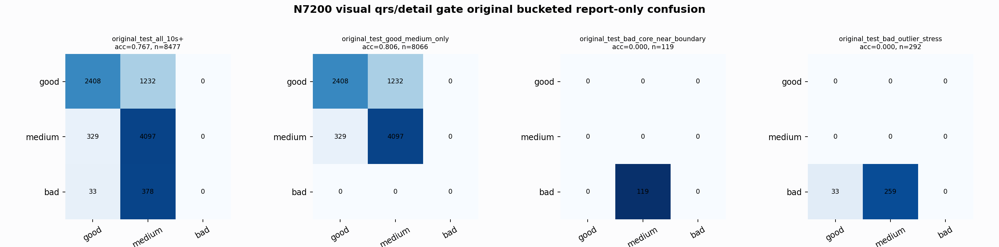

# N7200 Visual QRS/Detail Gate Original Bucketed Report

Report-only evaluation. It is not used for Clean/SemiClean/node selection.

## Rule Artifact

- Artifact: `rule_n7200_visual_qrsdetail_old_best_pred`
- Base: `nl_n7200_gm_trim_bad_goodlike_aux_tail_a12_good124_mid172_ec4f54fe7e3d` / `medium_guarded_pmed0005`
- Good rescue: predicted medium + `qrs_visibility >= 0.432896` + `non_qrs_diff_p95 <= 0.0589044` -> good
- Medium rescue: predicted good + `qrs_visibility <= 0.338125` + `non_qrs_diff_p95 >= 0.0699296` -> medium
- Threshold source: N7110 train+val overlap visual errors; original BUT not used.

## Buckets

- `original_all_10s+`: n=32956, acc=0.8325, macro-F1=0.8552, recall good/medium/bad=0.7733/0.8898/0.9080, flips=1792, fixed=1226, lost=564
- `original_test_all_10s+`: n=8477, acc=0.7674, macro-F1=0.5200, recall good/medium/bad=0.6615/0.9257/0.0000, flips=323, fixed=312, lost=10
- `original_test_good_medium_only`: n=8066, acc=0.8065, macro-F1=0.5317, recall good/medium/bad=0.6615/0.9257/0.0000, flips=322, fixed=312, lost=10
- `original_test_bad_core_near_boundary`: n=119, acc=0.0000, macro-F1=0.0000, recall good/medium/bad=0.0000/0.0000/0.0000, flips=0, fixed=0, lost=0
- `original_test_bad_outlier_stress`: n=292, acc=0.0000, macro-F1=0.0000, recall good/medium/bad=0.0000/0.0000/0.0000, flips=1, fixed=0, lost=0
- `original_test_drop_bad_outlier_reference`: n=8185, acc=0.7947, macro-F1=0.5284, recall good/medium/bad=0.6615/0.9257/0.0000, flips=322, fixed=312, lost=10
- `original_test_good_medium_overlap`: n=7492, acc=0.7916, macro-F1=0.5242, recall good/medium/bad=0.6580/0.9154/0.0000, flips=306, fixed=296, lost=10
- `original_all_bad_core_near_boundary`: n=4084, acc=0.9706, macro-F1=0.3284, recall good/medium/bad=0.0000/0.0000/0.9706, flips=0, fixed=0, lost=0
- `original_all_bad_outlier_stress`: n=1201, acc=0.6953, macro-F1=0.2734, recall good/medium/bad=0.0000/0.0000/0.6953, flips=2, fixed=0, lost=0

## Counts

- Original all 10s+: `32956` windows.
- Original test 10s+: `8477` windows.
- Bad outlier stress is reported separately because dropping it removes most original-test bad windows.

