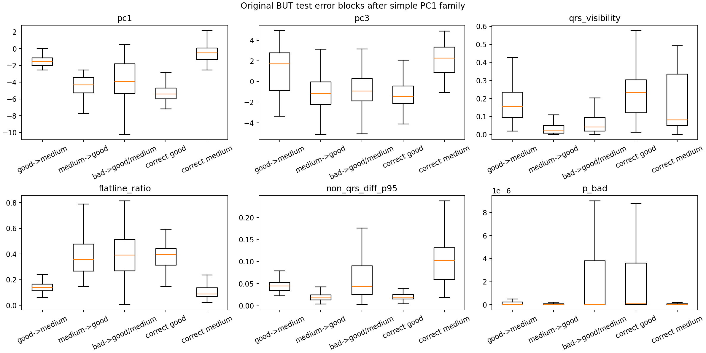

# Original BUT Block Breakthrough Search

Report-only diagnostic search. Original BUT is not used for Clean/SemiClean selection.

## Best By Validation Score

| method | rule | val_acc | test_acc | test_good_recall | test_medium_recall | test_bad_recall | test_gm_acc | test_bad_outlier_acc | all_acc |
| --- | --- | --- | --- | --- | --- | --- | --- | --- | --- |
| tree_depth4_upper_bound | /--- pc1 <= 3.97
/   /--- pc1 <= -1.51
/   /   /--- pc1 <= -2.37
/   /   /   /--- band_15_30 <= 0.10
/   /   /   /   /--- class: 0
/   /   /   /--- band_15_30 >  0.10
/   /   /   / | 0.9663 | 0.7209 | 0.9596 | 0.5646 | 0.2895 | 0.7429 | 0.0000 | 0.8586 |
| gm_plus_single_bad_axis | non-bad flatline_ratio <= 0.1473 -> medium else good; bad if pc1 > 2.5933 | 0.9490 | 0.7073 | 0.9514 | 0.5454 | 0.2895 | 0.7286 | 0.0000 | 0.8269 |
| gm_plus_single_bad_axis | non-bad flatline_ratio <= 0.1473 -> medium else good; bad if non_qrs_diff_p95 > 0.3686 | 0.9481 | 0.7087 | 0.9514 | 0.5481 | 0.2895 | 0.7301 | 0.0000 | 0.8293 |
| gm_plus_single_bad_axis | non-bad flatline_ratio <= 0.1473 -> medium else good; bad if non_qrs_diff_p95 > 0.2549 | 0.9481 | 0.7036 | 0.9514 | 0.5382 | 0.2895 | 0.7246 | 0.0000 | 0.8257 |
| gm_plus_single_bad_axis | non-bad flatline_ratio <= 0.1473 -> medium else good; bad if flatline_ratio <= 0.0320 | 0.9481 | 0.7040 | 0.9514 | 0.5391 | 0.2895 | 0.7251 | 0.0000 | 0.8257 |
| gm_plus_single_bad_axis | non-bad flatline_ratio <= 0.1473 -> medium else good; bad if non_qrs_diff_p95 > 0.3780 | 0.9481 | 0.7089 | 0.9514 | 0.5486 | 0.2871 | 0.7303 | 0.0000 | 0.8293 |
| gm_plus_single_bad_axis | non-bad flatline_ratio <= 0.1281 -> medium else good; bad if pc1 > 2.5933 | 0.9602 | 0.6818 | 0.9676 | 0.4833 | 0.2895 | 0.7018 | 0.0000 | 0.8248 |
| gm_plus_single_bad_axis | non-bad flatline_ratio <= 0.1473 -> medium else good; bad if flatline_ratio <= 0.0088 | 0.9473 | 0.7076 | 0.9514 | 0.5488 | 0.2579 | 0.7305 | 0.0000 | 0.8290 |
| gm_plus_single_bad_axis | non-bad flatline_ratio <= 0.1281 -> medium else good; bad if non_qrs_diff_p95 > 0.3780 | 0.9594 | 0.6834 | 0.9676 | 0.4864 | 0.2871 | 0.7036 | 0.0000 | 0.8273 |
| gm_plus_single_bad_axis | non-bad flatline_ratio <= 0.1281 -> medium else good; bad if non_qrs_diff_p95 > 0.3686 | 0.9594 | 0.6833 | 0.9676 | 0.4860 | 0.2895 | 0.7033 | 0.0000 | 0.8272 |
| gm_plus_single_bad_axis | non-bad flatline_ratio <= 0.1281 -> medium else good; bad if non_qrs_diff_p95 > 0.2549 | 0.9594 | 0.6782 | 0.9676 | 0.4763 | 0.2895 | 0.6980 | 0.0000 | 0.8237 |
| gm_plus_single_bad_axis | non-bad flatline_ratio <= 0.1281 -> medium else good; bad if flatline_ratio <= 0.0320 | 0.9594 | 0.6785 | 0.9676 | 0.4770 | 0.2895 | 0.6984 | 0.0000 | 0.8236 |
| gm_plus_single_bad_axis | non-bad flatline_ratio <= 0.1281 -> medium else good; bad if flatline_ratio <= 0.0088 | 0.9585 | 0.6821 | 0.9676 | 0.4867 | 0.2579 | 0.7037 | 0.0000 | 0.8270 |
| gm_plus_single_bad_axis | non-bad flatline_ratio <= 0.1473 -> medium else good; bad if flatline_ratio <= 0.0064 | 0.9447 | 0.7058 | 0.9514 | 0.5488 | 0.2214 | 0.7305 | 0.0000 | 0.8285 |
| gm_plus_single_bad_axis | non-bad flatline_ratio <= 0.1473 -> medium else good; bad if non_qrs_diff_p95 > 0.1435 | 0.9438 | 0.6501 | 0.9514 | 0.4336 | 0.3139 | 0.6672 | 0.0342 | 0.7746 |
| gm_plus_single_bad_axis | non-bad flatline_ratio <= 0.1473 -> medium else good; bad if p_medium <= 0.0000 | 0.9438 | 0.7052 | 0.9514 | 0.5488 | 0.2092 | 0.7305 | 0.0000 | 0.8283 |
| gm_plus_single_bad_axis | non-bad flatline_ratio <= 0.1473 -> medium else good; bad if p_medium <= 0.0000 | 0.9438 | 0.7052 | 0.9514 | 0.5488 | 0.2092 | 0.7305 | 0.0000 | 0.8283 |
| gm_plus_single_bad_axis | non-bad flatline_ratio <= 0.1473 -> medium else good; bad if p_medium > 1.0000 | 0.9438 | 0.7052 | 0.9514 | 0.5488 | 0.2092 | 0.7305 | 0.0000 | 0.8283 |
| single_feature_gm | non-bad flatline_ratio <= 0.1473 -> medium else good | 0.9438 | 0.7052 | 0.9514 | 0.5488 | 0.2092 | 0.7305 | 0.0000 | 0.8283 |
| gm_plus_single_bad_axis | non-bad flatline_ratio <= 0.1473 -> medium else good; bad if pc1 > 10.3024 | 0.9438 | 0.7052 | 0.9514 | 0.5488 | 0.2092 | 0.7305 | 0.0000 | 0.8283 |

## Best By Original Test Accuracy

| method | rule | val_acc | test_acc | test_good_recall | test_medium_recall | test_bad_recall | test_gm_acc | test_bad_outlier_acc | all_acc |
| --- | --- | --- | --- | --- | --- | --- | --- | --- | --- |
| single_feature_gm | non-bad pc4 <= 1.5075 -> medium else good | 0.2697 | 0.8301 | 0.7904 | 0.9205 | 0.2092 | 0.8618 | 0.0000 | 0.6284 |
| single_feature_gm | non-bad pc4 <= 0.6785 -> medium else good | 0.3665 | 0.8017 | 0.8695 | 0.8009 | 0.2092 | 0.8319 | 0.0000 | 0.6491 |
| single_pc1_threshold | non-bad pc1 <= -3.2074 -> good else medium | 0.5774 | 0.7874 | 0.8772 | 0.7673 | 0.2092 | 0.8169 | 0.0000 | 0.7803 |
| single_pc1_threshold | non-bad pc1 <= -3.3657 -> good else medium | 0.5618 | 0.7873 | 0.8635 | 0.7784 | 0.2092 | 0.8168 | 0.0000 | 0.7692 |
| single_feature_gm | non-bad pc1 <= -3.1350 -> good else medium | 0.5825 | 0.7873 | 0.8849 | 0.7607 | 0.2092 | 0.8168 | 0.0000 | 0.7856 |
| single_pc1_threshold | non-bad pc1 <= -3.1350 -> good else medium | 0.5825 | 0.7873 | 0.8849 | 0.7607 | 0.2092 | 0.8168 | 0.0000 | 0.7856 |
| single_pc1_threshold | non-bad pc1 <= -3.4463 -> good else medium | 0.5523 | 0.7871 | 0.8552 | 0.7847 | 0.2092 | 0.8165 | 0.0000 | 0.7637 |
| single_pc1_threshold | non-bad pc1 <= -3.2908 -> good else medium | 0.5687 | 0.7868 | 0.8698 | 0.7723 | 0.2092 | 0.8163 | 0.0000 | 0.7746 |
| single_pc1_threshold | non-bad pc1 <= -3.6875 -> good else medium | 0.5315 | 0.7859 | 0.8299 | 0.8032 | 0.2092 | 0.8153 | 0.0000 | 0.7464 |
| single_pc1_threshold | non-bad pc1 <= -3.0605 -> good else medium | 0.5946 | 0.7858 | 0.8901 | 0.7535 | 0.2092 | 0.8152 | 0.0000 | 0.7904 |
| single_pc1_threshold | non-bad pc1 <= -3.8466 -> good else medium | 0.5186 | 0.7857 | 0.8121 | 0.8174 | 0.2092 | 0.8150 | 0.0000 | 0.7351 |
| single_pc1_threshold | non-bad pc1 <= -3.6124 -> good else medium | 0.5393 | 0.7854 | 0.8357 | 0.7976 | 0.2092 | 0.8148 | 0.0000 | 0.7519 |
| single_feature_gm | non-bad pc1 <= -3.6124 -> good else medium | 0.5393 | 0.7854 | 0.8357 | 0.7976 | 0.2092 | 0.8148 | 0.0000 | 0.7519 |
| single_pc1_threshold | non-bad pc1 <= -3.7705 -> good else medium | 0.5264 | 0.7853 | 0.8201 | 0.8102 | 0.2092 | 0.8147 | 0.0000 | 0.7407 |
| single_pc1_threshold | non-bad pc1 <= -3.5300 -> good else medium | 0.5454 | 0.7848 | 0.8440 | 0.7897 | 0.2092 | 0.8142 | 0.0000 | 0.7574 |
| single_pc1_threshold | non-bad pc1 <= -3.9237 -> good else medium | 0.5169 | 0.7845 | 0.8041 | 0.8217 | 0.2092 | 0.8138 | 0.0000 | 0.7290 |
| single_pc1_threshold | non-bad pc1 <= -2.9885 -> good else medium | 0.6085 | 0.7841 | 0.8940 | 0.7472 | 0.2092 | 0.8134 | 0.0000 | 0.7948 |
| single_pc1_threshold | non-bad pc1 <= -3.9916 -> good else medium | 0.5117 | 0.7840 | 0.7978 | 0.8260 | 0.2092 | 0.8133 | 0.0000 | 0.7232 |
| single_pc1_threshold | non-bad pc1 <= -4.0673 -> good else medium | 0.5073 | 0.7822 | 0.7890 | 0.8299 | 0.2092 | 0.8114 | 0.0000 | 0.7170 |
| single_feature_gm | non-bad pc1 <= -4.0673 -> good else medium | 0.5073 | 0.7822 | 0.7890 | 0.8299 | 0.2092 | 0.8114 | 0.0000 | 0.7170 |

## Interpretation

- Clean/SemiClean is solved by a simple PC1 good/medium axis, but original test still has two large report-only error blocks.
- The first block is original test medium predicted good under the PC1 gate, so the original medium shell is shifted toward the Clean/SemiClean good side.
- The second block is original test bad outlier stress; current N7179 probabilities do not call these rows bad, even though all-bad-core remains strong.
- Any next training should target these as two broad blocks, not one-row frontier nudges.

