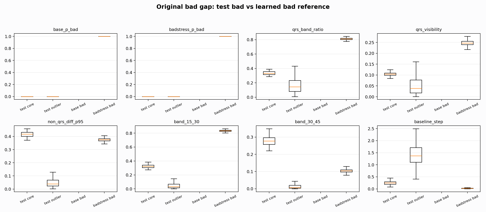
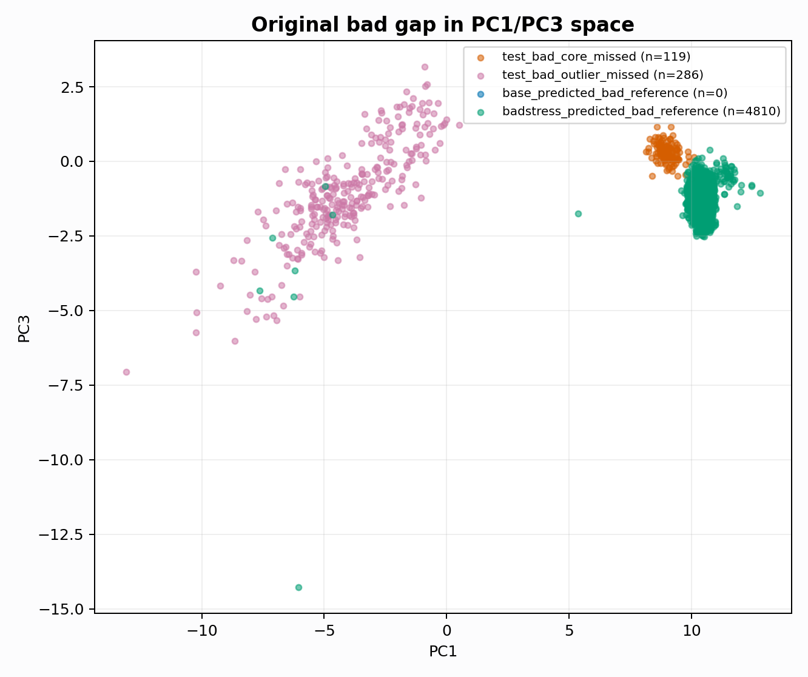

# Original Test Bad Gap Analysis

Report-only analysis. Original BUT is not used for model selection.

## Group Counts

| group | n | records | base pred counts | badstress pred counts | region counts |
|---|---:|---|---|---|---|
| all_non_test_bad_core | 1 | 114001 | `{"medium": 1}` | `{"good": 1}` | `{"near_bad_boundary": 1}` |
| all_non_test_bad_outlier | 69 | 100001,105001,113001,114001,124001 | `{"medium": 67, "good": 2}` | `{"medium": 61, "good": 8}` | `{"outlier_low_confidence": 69}` |
| badstress_predicted_bad_reference | 4810 | 105001,111001,114001 | `{"bad": 4799, "medium": 11}` | `{"bad": 4810}` | `{"right_bad_island": 3964, "outlier_low_confidence": 846}` |
| test_bad_core_missed | 119 | 122001 | `{"medium": 119}` | `{"medium": 119}` | `{"near_bad_boundary": 119}` |
| test_bad_outlier_missed | 286 | 111001 | `{"medium": 252, "good": 34}` | `{"medium": 241, "good": 45}` | `{"outlier_low_confidence": 286}` |

## Key Median Features

| group | base p_bad | badstress p_bad | qrs_band_ratio | qrs_visibility | non_qrs_diff_p95 | band_15_30 | baseline_step |
|---|---:|---:|---:|---:|---:|---:|---:|
| test_bad_core_missed | 0.0000 | 0.0000 | 0.3316 | 0.1041 | 0.4172 | 0.3210 | 0.2475 |
| test_bad_outlier_missed | 0.0000 | 0.0000 | 0.1450 | 0.0389 | 0.0397 | 0.0313 | 1.3706 |
| base_predicted_bad_reference | nan | nan | nan | nan | nan | nan | nan |
| badstress_predicted_bad_reference | 1.0000 | 1.0000 | 0.8107 | 0.2473 | 0.3750 | 0.8339 | 0.0268 |

## Interpretation

- `original_test_bad_core_near_boundary` is currently predicted as medium, not because all bad is impossible: non-test bad core is learned with high recall.
- The test bad buckets should be treated as a separate domain-stress bad subtype before being used for generator expansion.
- Next safe training step is not a broad bad outlier dump; it is a controlled bad subtype shaped by these feature gaps, with good/medium boundary metrics as guardrails.

