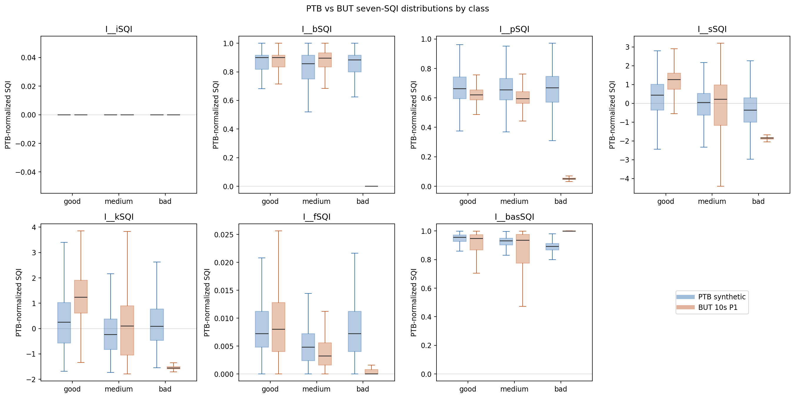
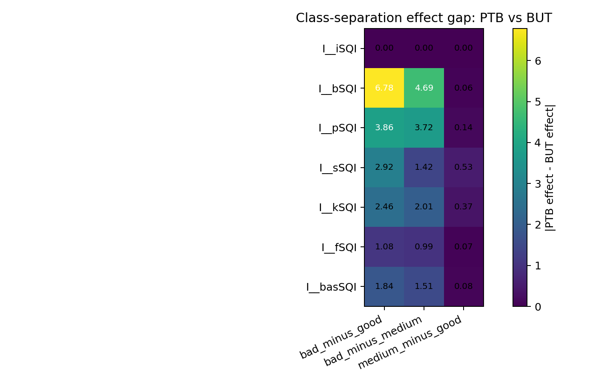
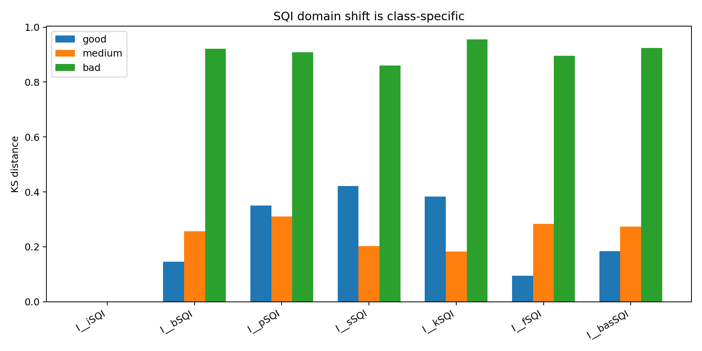
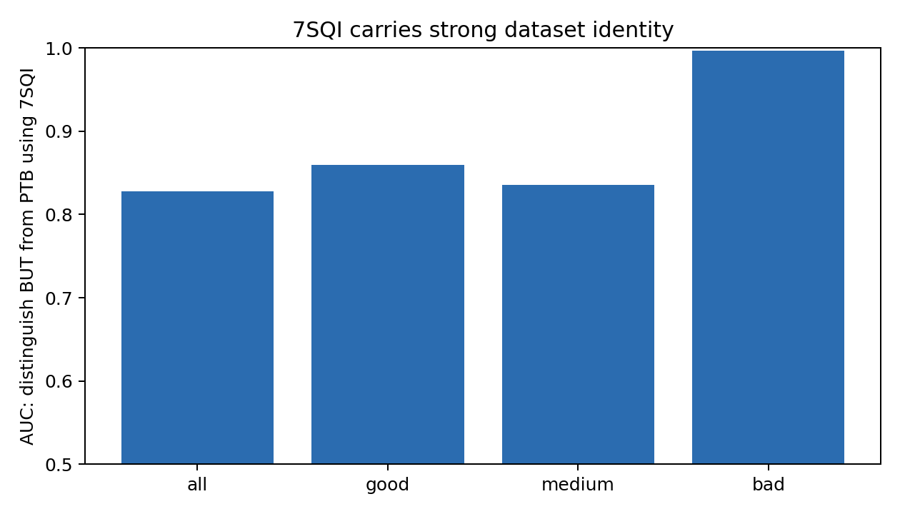
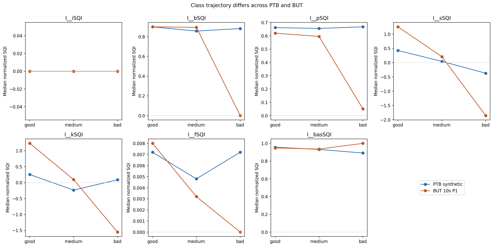

# PTB vs BUT Seven-SQI Domain Gap

This report compares the same seven traditional SQI features on PTB synthetic training data and formal BUT 10s P1 windows.

## Executive Summary

- 7SQI can distinguish BUT from PTB with AUC 0.828, so it carries strong domain identity in addition to quality evidence.
- Largest class-wise distribution shifts: I__kSQI/bad KS=0.96, I__basSQI/bad KS=0.92, I__bSQI/bad KS=0.92, I__pSQI/bad KS=0.91, I__fSQI/bad KS=0.90
- Some SQI class directions flip between PTB and BUT: I__bSQI bad_minus_good, I__bSQI bad_minus_medium, I__kSQI bad_minus_medium, I__basSQI bad_minus_good, I__basSQI bad_minus_medium. This explains why high SQI weight can help calibration but may also hurt one boundary.
- Implication: use SQI as a higher-weight but calibrated branch, not as a replacement for morphology/Uformer features.

## What We Measured

- Features: iSQI, bSQI, pSQI, sSQI, kSQI, fSQI, basSQI from noisy ECG only.
- PTB source: `outputs/controls/e311f_ptb_sqi_three_class/features/record7*.parquet`.
- BUT source: `outputs/external_benchmarks/e311_but_sqi_fusion_ptb_train_10s_2026_06_04/feature_cache/but_sqi7`.
- BUT protocol: formal 10s P1; no 5s/ensemble data is used.

## Strongest Domain-Signature Result

- Most separable slice: `bad` with domain AUC `0.997` and balanced acc `0.980` using only 7SQI.

## Largest PTB/BUT Class-Separation Mismatches

| feature | contrast | PTB effect | BUT effect | abs gap | alignment |
| --- | --- | ---: | ---: | ---: | ---: |
| I__bSQI | bad_minus_good | 0.001 | -6.779 | 6.781 | -1 |
| I__bSQI | bad_minus_medium | 0.184 | -4.502 | 4.685 | -1 |
| I__pSQI | bad_minus_good | -0.107 | -3.964 | 3.858 | 1 |
| I__pSQI | bad_minus_medium | -0.051 | -3.772 | 3.721 | 1 |
| I__sSQI | bad_minus_good | -0.668 | -3.586 | 2.918 | 1 |
| I__kSQI | bad_minus_good | -0.056 | -2.518 | 2.461 | 1 |
| I__kSQI | bad_minus_medium | 0.458 | -1.556 | 2.014 | -1 |
| I__basSQI | bad_minus_good | -1.138 | 0.701 | 1.839 | -1 |

## Recommendation For The Next Fusion Run

- Increase SQI branch strength, but keep validation-only BUT calibration because the SQI domain signature is strong.
- Prefer branch-logit fusion over pure concat: SQI needs an explicit path to influence logits.
- Keep Uformer features in the model: SQI-only still cannot explain good/medium morphology boundaries.

## Figures

