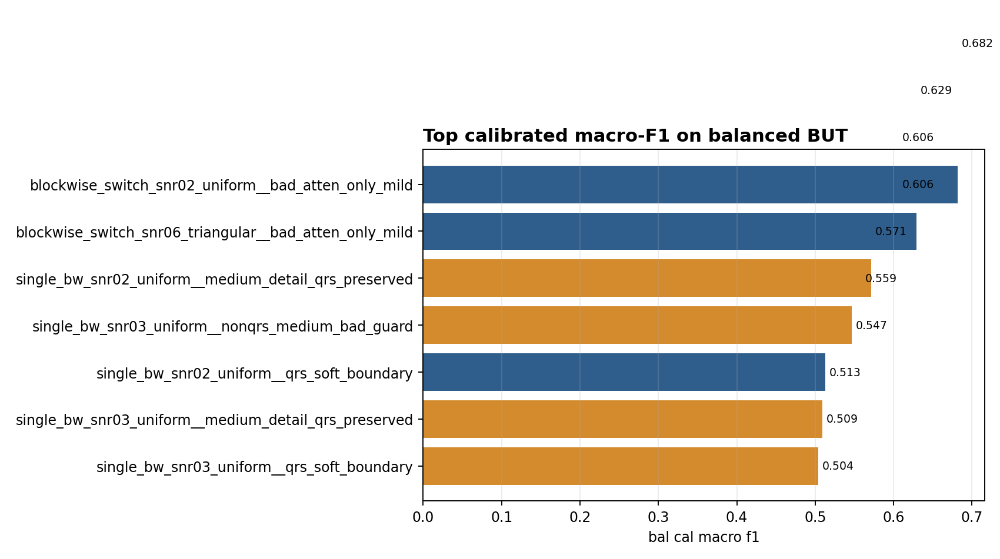
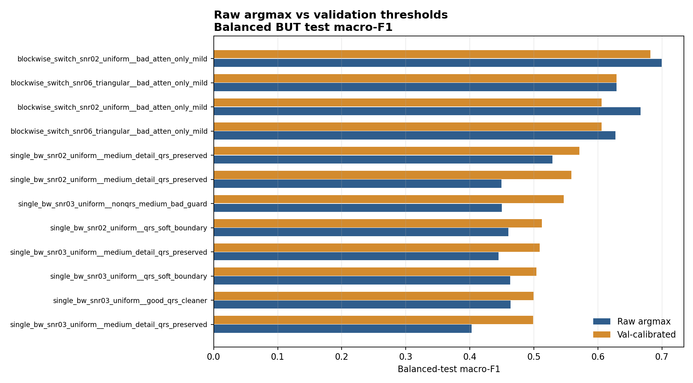
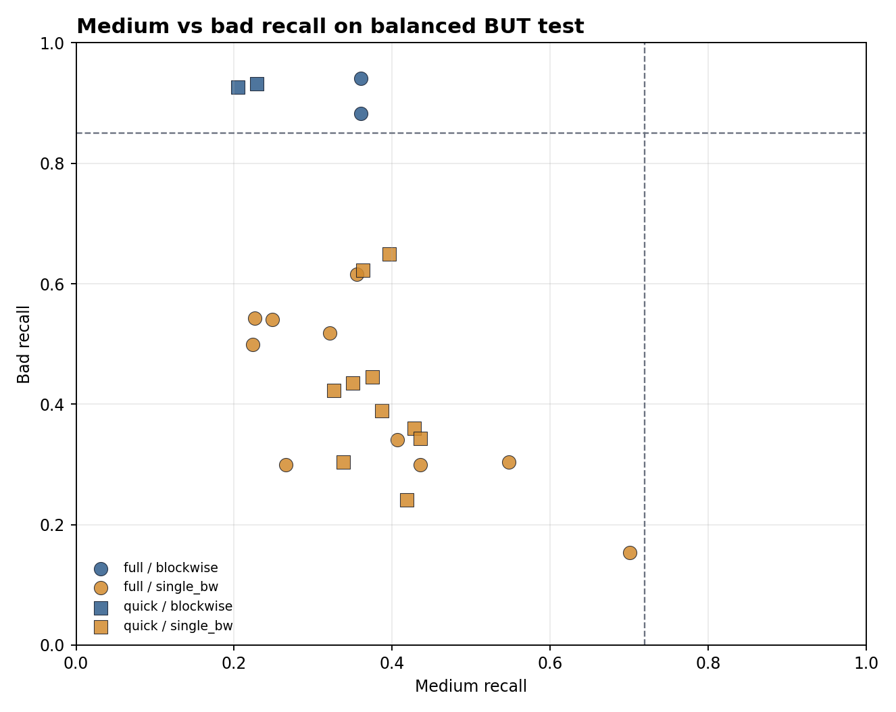
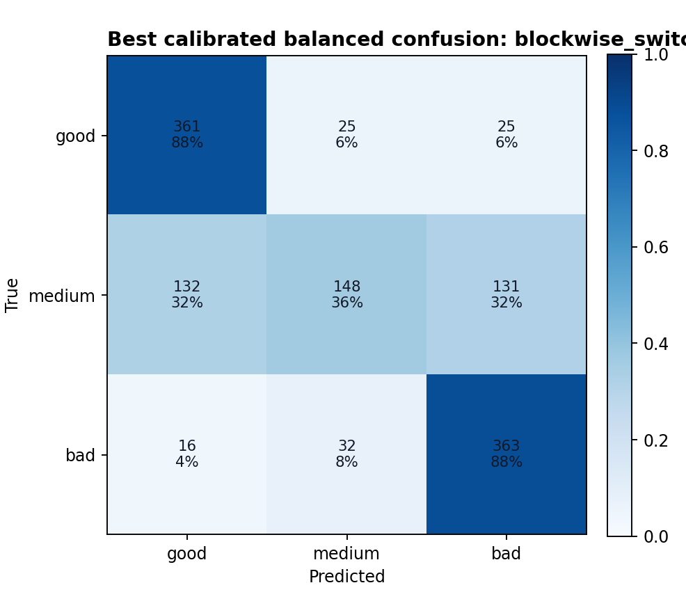

# BUT Balanced-Test QRS Result Analysis

## Executive Summary

- **The balanced subset confirms the QRS-guided direction is real but still incomplete.** The best calibrated balanced-test row is `blockwise_switch_snr02_uniform__bad_atten_only_mild` with acc `0.7072`, macro-F1 `0.6820`, and recalls `0.878/0.360/0.883`.
- **Raw argmax is better than validation-threshold calibration on the best row.** For `blockwise_switch_snr02_uniform__bad_atten_only_mild`, raw balanced-test macro-F1 reaches `0.6997` versus calibrated `0.6820`. The threshold policy is over-correcting toward bad and suppressing medium.
- **The gain is not just class imbalance math.** On the original imbalanced test, macro-F1 underweights the practical fact that bad has only 411 examples; on the balanced subset, bad errors become visible without being drowned by good/medium volume. The same best blockwise-QRS family remains on top.
- **The bottleneck is now sharply localized: medium.** The best calibrated balanced row has bad recall `0.883` and good recall `0.878`, but medium recall only `0.360`. This says the current real-noise/QRS recipe learned `usable vs fatal` better than the independent BUT medium cluster.

## What Changed After Balancing

The formal test split is `good=3640`, `medium=4426`, `bad=411`. The balanced subset uses `411` windows per class. This makes accuracy equal to balanced accuracy and prevents good/medium volume from hiding bad performance.

The top variants are all blockwise real NSTDB noise with mild QRS attenuation. Single-BW variants can preserve PTB sanity and denoise well, but they do not separate BUT bad and medium as cleanly.

## Calibration Is Hurting Medium

Validation thresholds were chosen on a tiny and skewed val split (`good=969`, `medium=105`, `bad=83`). On the balanced test, the raw logits often keep more medium signal. This strongly suggests the next external evaluation should report both raw argmax and validation-calibrated thresholds, or calibrate with a class-balanced validation objective/subsample.

## Medium-Bad Tradeoff

The desired upper-right region is medium recall >= 0.72 and bad recall >= 0.85. Current QRS-guided models move upward on bad but stay far left on medium. That is useful evidence: QRS fatality is now captured, but BUT medium is not simply weaker bad or lower SNR.

## Best Confusion Pattern

The best model confuses medium almost symmetrically into good and bad. That matters: if medium were just a scalar quality midpoint, errors should mostly move to one side depending on threshold. Instead, the model is missing medium's independent signature.

## Group Summary

### By Noise Mix

| mix_family | n | bal_macro_mean | bal_macro_max | bal_bad_mean | bal_medium_mean | raw_minus_cal_macro |
| --- | --- | --- | --- | --- | --- | --- |
| blockwise | 4 | 0.6307 | 0.6820 | 0.9209 | 0.2883 | 0.0249 |
| single_bw | 20 | 0.4847 | 0.5713 | 0.4163 | 0.3774 | -0.0380 |

### By Training Mode

| mode | n | bal_macro_mean | bal_macro_max | raw_minus_cal_macro | ptb_acc_mean |
| --- | --- | --- | --- | --- | --- |
| full | 12 | 0.5065 | 0.6820 | -0.0334 | 0.9170 |
| quick | 12 | 0.5115 | 0.6059 | -0.0217 | 0.8981 |

## Interpretation

1. **Balanced test makes the QRS direction look healthier, not worse.** The best model is much more balanced than the original accuracy suggested.
2. **Blockwise switching is doing real work.** It better matches BUT's free-living non-stationary signal quality than single BW.
3. **Val calibration is unreliable here.** The validation bad/medium counts are too small; raw logits may be a better diagnostic view for now.
4. **Next generator work should target medium as its own cluster.** Keep fatal OR/QRS bad, but add medium-only P/T/ST/detail unreliability without pushing those samples into bad.

## Files

- `balanced_qrs_rows.csv`: row-level metrics joined from original, balanced calibrated, and balanced raw evaluations.
- `balanced_qrs_summary.json`: top candidates and aggregate diagnostics.
- `figures/`: static PNGs used in this report.
